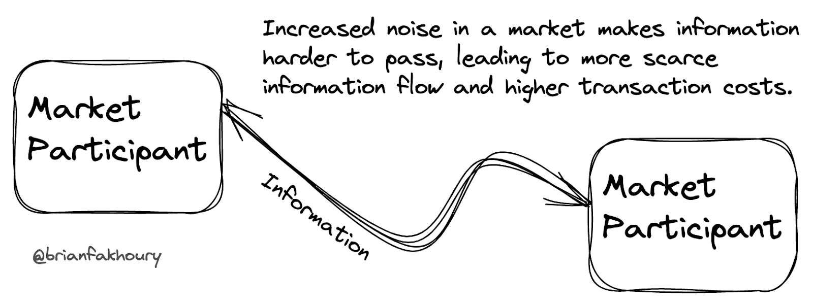
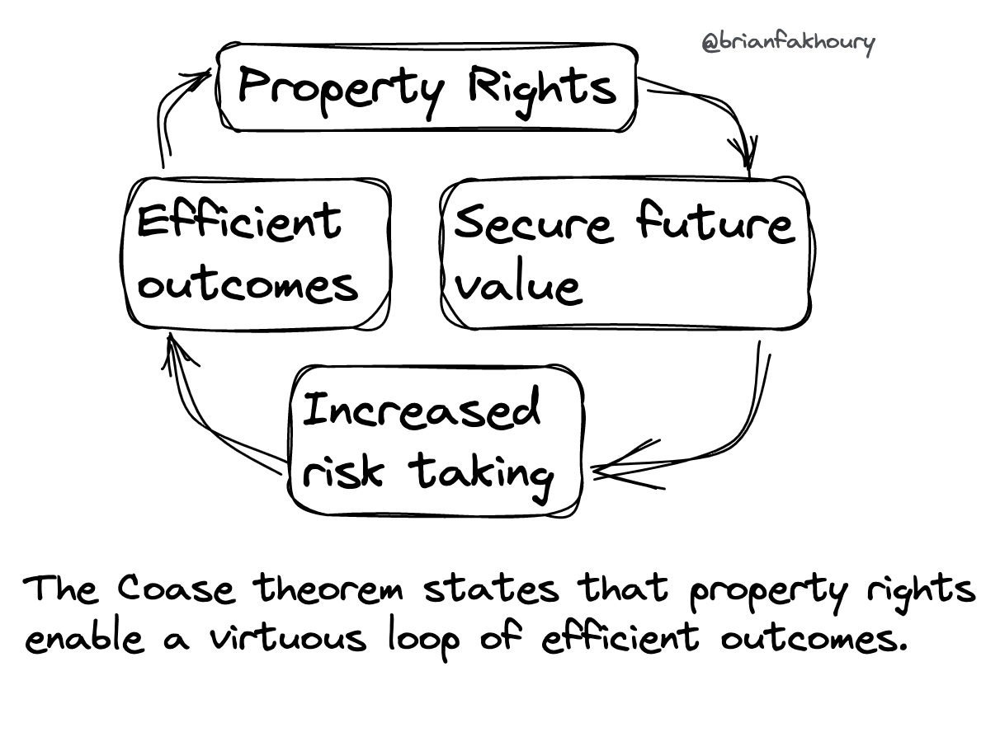
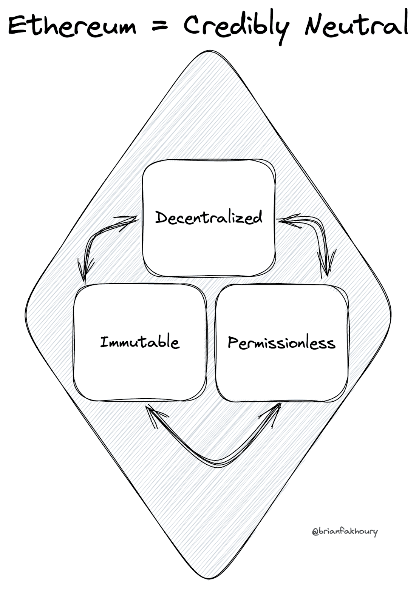
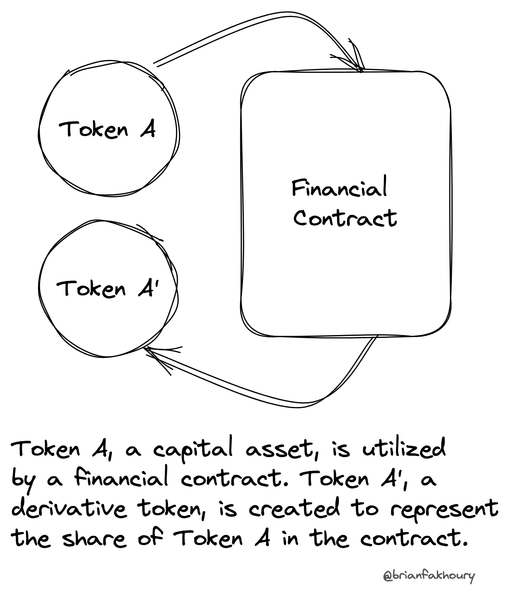
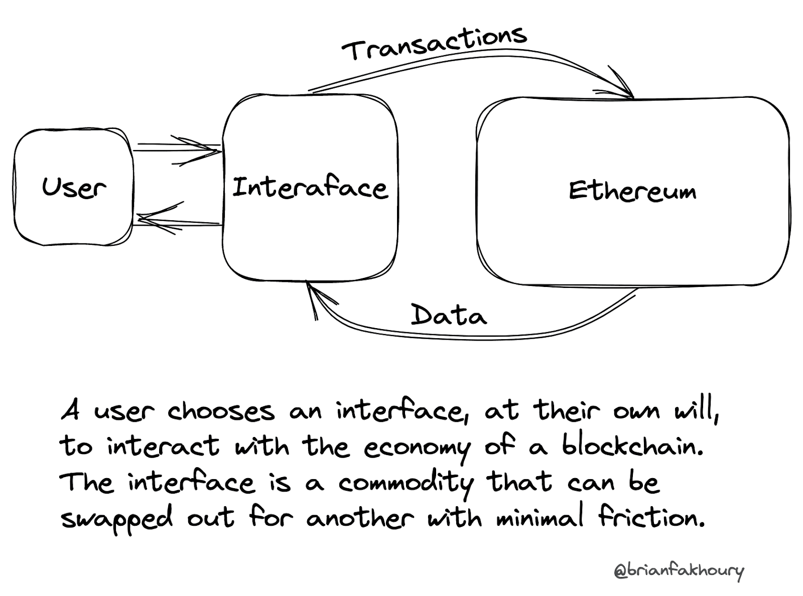
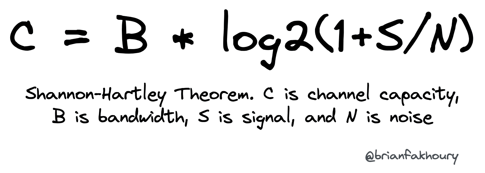
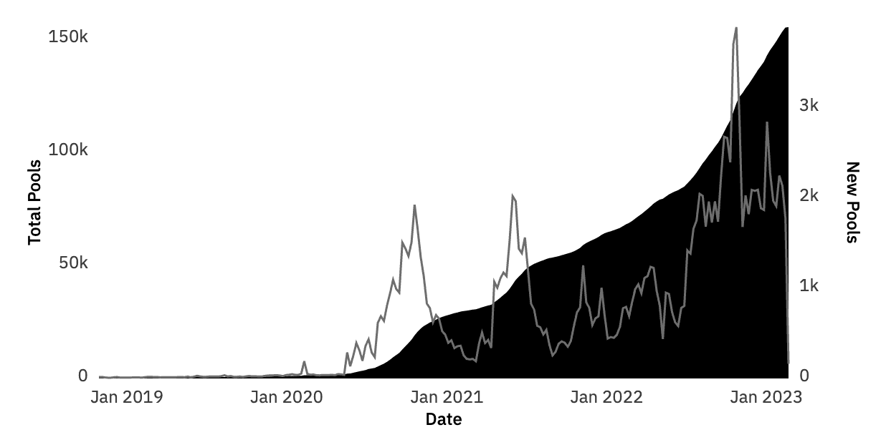
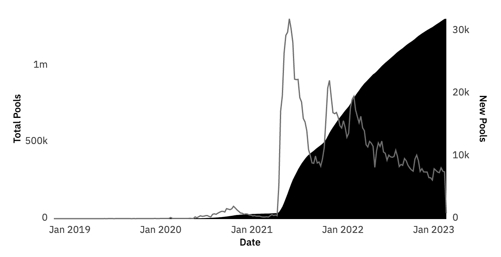
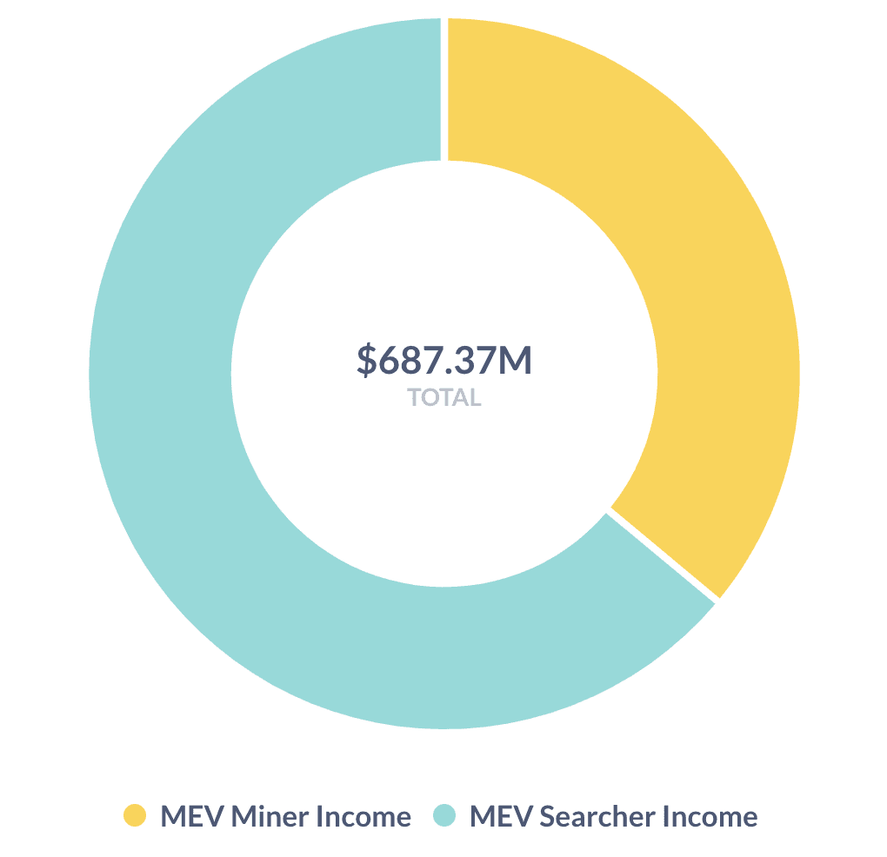
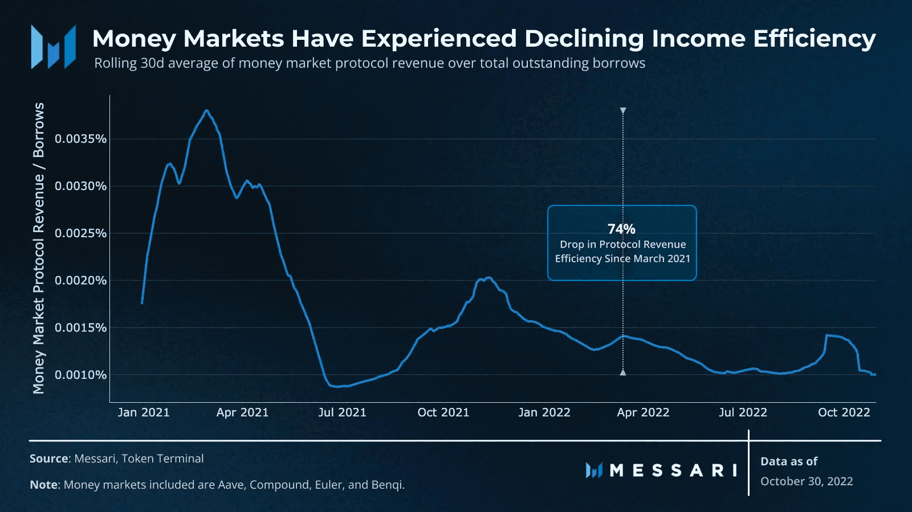

---
tags:
  - crypto
  - markets
  - history
date: Feb 24, 2023
publish: true
image: images/million-markets/03d86356704f7698bf35ac4756076ada_MD5.jpg
slug: million-markets
origin: https://mirror.xyz/fakhoury.eth/0aHTR9U5cUlF2oF0PkyHAYsFnaM-LxkVHqEDUAmdrGs
description: 
title: "A Million Markets: From the Bazaar to the DEX"
---
At Mechanism Capital, I come across countless investment opportunities in the incipient decentralized finance (DeFi) industry. When I do, I usually share the same reaction with my team: “it's another perp market” or “it’s just a uniswap fork”. Despite this abundance of market infrastructure, our reactions to this pattern likely stem from the observation that there are not many useful crypto assets to be traded. It’s like having the most luxurious, expansive supermarket imaginable with the most sophisticated automation tech and an incredibly optimized customer experience, yet it has only a meager selection of customers and products. After months of dismissing this observation, I finally began to investigate the reason behind this phenomenon. I realized that this is not a fleeting trend, it is an unavoidable evolution of markets and the optimal way of distributing economic power to individuals. We are now in the dawn of a million markets, and it is a revolution.

The story of the modern economy is told in part by evolving forms of trade that are centered around markets, both physical and digital. Capital markets today are dominated by complex derivative instruments on digitized exchanges controlled by large companies and regulated by the state. Markets didn’t always run in this regime, and it’s likely they won’t for much longer. The costs associated with standing up a market have historically been both prohibitive and stimulating. High-cost markets required lots of effort was spent to ensure quality, yet this also limited the exploration of the long tail of financial ideas.

The extraneous costs of setting up and running a market have collapsed in the Age of Information, and the composable, permissionless digital economies built on blockchains will further reduce these costs and democratize this ability. I expect millions of markets to be created because the deployment of a new capital market has become as easy as creating a basic website. This removal of friction will bring forward a new age of free and resilient markets.

# A Brief History

_The historical recounts I want to mention all point to the common theme of markets being created to reduce risk, and inadvertently self-organizing into novel economic primitives that spur new market participants as well as behaviors. At the risk of losing reader interest, I’ll keep this section shorter than it could be._

Markets have existed for as long as written history, with the first Bazaars popping up in the Middle East around 3000 B.C. Some of the earliest discovered writings were accounts of marketplace transactions, the beginning of a megatrend in commerce driving technological innovation.

Some may claim that the most influential cause for markets to develop was the growth of international trade. The Phoenicians, the Arabs, and other merchant adventurers transported products across the known world, putting their lives and assets at great risk for an even greater return. International trade was important precisely because it was carried out by completely disconnected third parties. In contrast, trade within a specific society was bound by rules and regulations that ensured trade was done “fairly”. Adam Smith observed this as a great leap wherein trade released the forces of industrial production. Commercial forces were all that mattered when it came to things like the ancient silk road, the European wool trade, etc…, undermining the feudal myths set up within countries.

Although not true in the 21st century, trade historically required a shared geographic location to commence. In ancient Greece, the agora served as both a marketplace and a gathering place for political and social activities. On the other hand, the Roman forum was primarily a market where merchants from all over the empire came to trade their goods. During the Middle Ages, markets became an important part of life in European towns and cities. These markets were typically held once a week and were individually regulated by local authorities. The merchants who sold their goods at these markets were known as "burghers," and they played a significant role in the growth and development of European cities. While most civilizations had some form of a “market,” the ancient historian Herodotus noted that the Persians did not have marketplaces, which reminds us that some forms of exchange are not always commercial (they are incentivized for reasons other than pure business).

All this activity allowed for the first _capital markets_ to emerge, in which accounts could be settled at a future date with capital exchanging hands immediately. The first capital markets are thought to have appeared in the early 1600s in Osaka, Japan. They were built around rice trading. The story goes – a Japanese rice merchant met a friend from the north of Japan, who said that the rice yield in the north was not good that year. The merchant bought the future rice harvest in his local area, paying the farmers 10% upfront and owing them the rest at delivery. After the harvest came in, he stored the rice for several months, selling it for a profit once the north’s poor harvest had driven prices up.

Markets have bewildered people for centuries, as they often appear to be morally corrupt or extractive, yet they have the magical power to organize communities and provide stability and upward mobility. In the 1700s Reverend Richard Whately, a professor of political economy at Oxford University, suggested that such an emergent organization (of markets) was indisputable evidence that God exists, put in motion by His invisible hand. Regardless of associated costs, this self-organizing feature of markets proved to be the leading cause of market structure innovation. In 1792, John Sutton set up a securities marketplace at 22 Wall Street to let investors sell stocks and bonds through an auction process. There was a critical bug in this market structure as other brokers figured out that the deep liquidity of John Sutton’s auction allowed them to arbitrage the exchange by sitting in and observing the auction prices, then mediating trades at the same price, but with a lower fee. Perhaps this was the birth of the modern market maker (firms that specialize in earning a profit by ensuring a market has a deep supply for buyers and sellers). Still, the New York securities market was one that self-innovated as Sutton’s model could no longer accurately discover prices because of a lack of real participants. This resulted in an agreement amongst 24 Manhattan brokers to trade securities at fixed fees without worrying about external competition leeching pricing information (an issue that we’ll see again in decentralized crypto markets). The agreement was enforced through contracts, which of course relied on the strong US legal system.

Self-organization doesn’t always result in positive externalities. In the case of the East India Company, one of the first chartered companies established in Britain in the 1600s, the company's trade with Indian merchants slowly became a form of government whereby commercial profits were replaced with tax revenues. Whether this occurred because of the frictions around establishing a chartered company (which was almost insurmountable in terms of cost and political risk until the Bubble Act of 1720 was repealed and the Joint Stock Companies Act was put in place in 1844) or because the company directors and managers were evil, it highlights that the fair outcome in markets is not guaranteed. In other cases, it’s the opposite. With the collapse of the Soviet Union and its corresponding markets, the Vietnam government found itself with broken trucks, and no way to fix them due to the disappearance of the Soviet auto parts industry. Funny enough, when the government gave each truck driver partial ownership of their trucks, the vehicles began to work again. Peculiar. That’s to say, the invisible hand of markets is only one factor in the outcome of economies.

# Fundamentals of Markets

Before continuing, it’s useful to define some of the fundamental assumptions, or invariants, of any _free marke_t that will hold true regardless of the technology behind it, namely:

1. Information must flow freely
2. Property rights must be upheld
3. Promises can be trusted

In fact, it’s not hard to see how blockchains have completely rewritten the book on how these invariants are maintained. Information is able to flow freely as part of the public state of the network (available 24/7), property rights are maintained through a credibly neutral settlement mechanism, and promises are upheld by self-executing code.

## Information Flow

Information flow in markets is most directly related to transaction costs. As information flow increases, transaction costs typically decrease. This is why the internet brought so much change to markets: transaction costs dropped dramatically with the advent of digital communication. As the business historian Alfred Chandler explains, “Modern business enterprise became viable only when the visible hand of management proved to be more efficient than the invisible hand of market forces.” Chandler credits better management to business progress. I think it’s safe to say that technological progress in communication tools has greatly contributed to this ability for better management.

Another way to think about information flow is by using Information Theory, first framed by Claude Shannon in 1948. Information theory is a mathematical framework for analyzing communication systems, including the transmission and processing of information. At its core, Shannon's theory is concerned with quantifying and measuring information and provides a precise definition of the term "information" as the reduction of uncertainty, or the amount of surprise in a message. The basic unit of information in Shannon's theory is the "bit," which can represent one of two possible values. One of the key concepts in Shannon's theory is the idea of "entropy," which is a measure of the amount of information in a message. Entropy is related to the degree of unpredictability or randomness in a message and is independent of the actual content of the message. For example, a highly predictable message (such as a long string of repeated characters) may have a low entropy, even though it contains a large number of bits. Shannon's theory also introduced the concept of "channel capacity," which is the maximum rate at which information can be transmitted over a noisy communication channel without error. This capacity is limited by factors such as bandwidth and signal-to-noise ratio and can be increased by using error-correcting codes and other techniques. One of the most significant results of Shannon's theory is the "Shannon-Hartley theorem," which provides a formula for calculating the maximum data rate of a communication channel based on its bandwidth and signal-to-noise ratio. This theorem has had a profound impact on the development of digital communication systems and remains a fundamental concept in modern information theory.

As it relates to markets, technological progress in market structure has reduced the entropy of information flows while simultaneously increasing channel capacity (we’ll see more of why that is as it relates to blockchains). Using this quantification standard, we can compare market structures and rate their information flow capability by comparing the entropy and channel capacity.

## Property Rights

Ownership is the strongest source of incentive (as the Vietnam truck example illustrates). In order for people to feel like they truly own something, they need to be convinced of their property rights. This comes back to a natural function of government – to guarantee property rights. Some argue that land ownership, and the associated property rights, are the basis of strong, effective capitalism. This thinking stems from the fact that all capital can be reduced to productive land. Without productive land, most “productive” capital assets could not exist. With strong property rights come security and risk-taking, hand in hand, by market participants.

Property rights are hard to come by in the physical world. It takes decades for governments to build trust in the relevant institutions, and markets have to test the murky waters to be sure that the expected security guaranteed by the property rights system is really there. Regarding blockchains, property rights can be built completely with code and guaranteed without any humans in the loop. This condition becomes especially relevant when we compare the time it takes for the government to build a property rights track record to the time it takes for a new blockchain, much less an existing one, to build confidence in its property rights system.

## Promises

Finally, we come to the beating heart of a market, the contractual promises that underlie any transaction. A market is fundamentally built out of transacting parties that use either 1) a predefined set of promises (like on a formal exchange) or 2) individually created promises when it comes to a loosely collected market. Promises can come from many sources, not just the two involved parties. The government can enact promises to defend a certain side of a transaction, as is the case with patent law. An intermediary can promise to uphold an externality of a transaction. The list goes on, but at its core, a market can only continue to function if the promises are kept. We take this for granted, as when some contractual agreements go awry, the legal system can take steps to ensure the promises are upheld, but the truth is that the legal system is nothing more than a promise for the government to keep markets in order.

For millennia, people have learned to be comfortable with the promises of other humans. Thanks to crypto, our generation is the first to learn to trust the promises of mathematical proofs. While proofs have been used in science and engineering to promise the reliability of systems for centuries, modern cryptography has brought this principle to the next level. Markets have always been built around some failure mode of promises, but what happens when humans have the power to create promises as strong as physics itself? The fabric of markets will shift, and we have evidence that this is happening.

# The State of Market Microstructure

Markets have, for the most part, always been principally decentralized, yet some modern capital markets have become the opposite – highly centralized. For example, there aren’t as many stock exchanges today as there were 100 years ago. This is due, in part and as mentioned earlier, to the technological limitations we have when it comes to human coordination. In order to process billions of requests and trillions of dollars on top of legacy financial rails that take days to settle accounts, modern digital markets need to be tightly controlled by companies and closely regulated by governments, a far cry from “natural market forces.”

In some ways, these markets are like pressurized balloons waiting to pop. By making modern markets highly centralized, we’ve lost some of the crucial anti-fragility that comes from decentralized markets that society once enjoyed – namely the protection from contagion effects and freedom to choose where to transact. There was a time when you could physically take a capital asset to a neighbor's house and strike a deal over the kitchen table. While this peer-to-peer transaction might sound old-fashioned, it is the most robust way to keep markets free and healthy. Thankfully, we’ve arrived at a point in the digital future where we can recreate these same dynamics and maintain the benefits of internet-scale communication.

I admit that I am no expert in the technical details of modern digital markets, but you’ll find these markets so opaque that their leading participants sometimes struggle to explain it themselves; this explains why it can take months to investigate incidents of market failure stemming from fraud, lack of liquidity, and opacity. I don’t think that the entirety of centralized capital markets will come crashing down, but rather I worry about the lack of belief for startups to disrupt and challenge the status quo. It’s too expensive, too bureaucratic, and technically insurmountable. Fortunately, the age of a million markets is here.

## Crypto Networks

As the Internet did with publishers, blockchains have aided the transformation to a world where the marginal cost of a new market is approaching zero. For the rest of this essay, I prefer to reference Ethereum specifically because it embodies many of the ideal blockchain properties. It is possible that a “blockchain” can have the exact opposite properties of what we outline here, so be wary of imposters. If you’re familiar with these properties already, you’ll be fine skipping this section.

### Permissionless

Ethereum is permissionless. The product that a blockchain sells, namely the space inside of its blocks, can be used by any being who can operate a computer (and even that isn’t general enough). Furthermore, there’s no restriction on how to use this space. This is perhaps why scams run so rampant in our industry, as a lack of moral authority promotes any form of profit-seeking (if it’s profitable, it will happen). Using a blockchain is synonymous with freely expressing speech through a set of cryptographical and mathematical helper tools (you might be more familiar with the term “wallet”). This goes back to one of the core tenets of markets: property rights. Because of the radically open nature of a blockchain, any user can be extremely confident in their ability to own an asset so long as they understand what is underlying it.

Let’s look at the example of taking out a loan against the value of your house. You plan to stick to a safe debt-to-value ratio of 5%. It’s likely you can find a bank that is willing to issue this loan, but you cannot say for certain that you will get the loan. A number of issues complicate the loan origination process, such as ensuring that you haven’t taken out other loans against your house without disclosing them. Beyond that, the loan can only occur under the bank's permission for certain market participants (ie: only if you’re a US citizen with a credit history). Needless to say, you aren’t able to get this loan “permissionlessly,” even if it’s perfectly viable.

In contrast, let’s say you want to take out a loan against your ether (the native commodity money of the Ethereum network). You find a decentralized lending market like Aave and create a transaction (on your local computer) that deposits ether into an Aave smart contract. You then make another transaction that borrows 5% of the value of that ether in a stablecoin like USDC. Without having to understand the inner working of a blockchain, you know that the whole supply chain for you to get that loan occurred under your complete discretion, with no third party having to approve the transaction.

While permissioned systems can be built on Ethereum (it’s a fully programmable computer), the relevant point is that users can have the choice, in a free and open market, to use the permissionless versions of the systems that they need. This applies to other market activities like payments and trading as well. The permissionless nature of a cash-based economy is back, and it’s orders of magnitude better in digital form, precisely because of the increased information flow.

### Immutable

Ethereum is immutable. This means that the state of the blockchain, the store of balances and contract codes governing the network economy, is reliable information today, tomorrow, and into the future so long as an observer has the necessary knowledge or software to locally verify the cryptography. Practically speaking, this means that the end-user of Ethereum is assured that without access to the private key for their account, no transactions involving their assets can occur. This level of guarantee has been historically impossible to achieve.

Double-entry bookkeeping (invented hundreds of years ago and helping to usher in modern markets) is not as immutable as Ethereum. For example, a motivated third party could conceivably alter the ledger of both parties in a double-entry system, and risk almost nothing as it relates to the value of double-entry bookkeeping as a whole to society. Ethereum on the other hand is a hyper-reactive chain of information. Try to alter one bit of it, and you corrupt the rest of the state of the chain. It’s like spontaneous combustion – by the laws of physics, it is bound to happen. This means that in order for you to “alter” the state of an account that is not your own, you would have to convince the entire network, in broad daylight, that what you have done is okay. This is like trying to create a fraudulent balance sheet in a company while the whole world is watching a live stream of you performing every action. It will be caught, and everyone will instead stick with the version of reality that you did not touch.

### Decentralized

Ethereum is decentralized. In order for it to have the aforementioned properties, it is not necessary to rely on any person or group of people. Instead, the definition of the protocol, agreed upon by thousands of participants explicitly (and millions of users implicitly) is the only necessary trust in the whole system. Given the rigorous engineering and mathematical analysis and years of operation securing billions of dollars of value, it’s not hard to be comfortable with the assumption that the protocol is well-defined. By being extremely decentralized (measured by the distribution of parties running the network), Ethereum is credibly neutral. This means that any user can be comfortable knowing that there is no structural disadvantage to their using the network and receiving the benefits of permissionless and immutable transactions.

## Market Structure in Blockchain Economies

Market structures on blockchains today are skeuomorphic in many ways, mimicking the structure of traditional markets, which shows that the technology is still young. This is similar to the first websites of newspapers, which were literal scans of the newspaper, then morphing into the digital article formats that we see today.

Some of the main novelties in blockchain-based, decentralized markets are peer-to-pool matchmakers, composable liquidity, open frontends, fork-able protocols, 24/7 uptime, and maximum extractable value (MEV). These innovations are all due to the three properties of blockchains mentioned in the previous section. These novelties mean that the market structure in an economy like Ethereum is strongly connected and becomes more efficient as a function of capital in the system. Let’s first review the fundamentals of some of these novelties, and then try to tie them together with Shannon’s Information Theory to paint the arrow of evolution.

### Peer-to-pool

Bitcoin started the crypto revolution by introducing the idea of peer-to-peer digital cash. This refers to the permissionless nature of blockchains that make payments function similarly to the way payments are made with physical cash. As decentralized finance (DeFi) emerged on Ethereum to provide the full set of financial services that complement payments, it was discovered that demand to provide counterparty services to financial actions like trading and lending could be pooled together, again due to the permissionless nature of blockchains.

In the peer-to-pool model, users interact with pools of capital on their own time, utilizing the rules governing the pool of capital to perform their desired action. For example, trading Ether (ETH) for a stablecoin like USDC does not resemble historical capital markets where two parties must coincide to perform the exchange. Instead, there exist pools of ETH and USDC, existing because other users are incentivized to earn fees, of which a trader can come to deposit ETH and withdraw USDC. The price of the transaction is governed by a piece of code, an impartial smart contract on the Ethereum blockchain, and is completely permissionless.

To be nuanced, we should recognize two facts. First, the rise of the peer-to-pool market structure is largely due to prohibitive transaction fees demanded by blockchains like Ethereum. Peer-to-peer models of trading and lending were simply cost-prohibitive in the early versions of smart contract blockchains. Second, historical capital markets do have pools of capital called market makers and funds. These are usually independent entities that provide the counterparty to a trade, solving the issue of coincidence needed for a trade to happen. Still, these entities are a long shot from the permissionless nature of peer-to-pool systems. Permissionless on-chain markets make the playing field more equal and accessible. Furthermore, they spur innovation through composability, which we’ll explore next.

### Composable Liquidity

The rise of “tokenization” as a standard format for assets on blockchains comes from the fact that the cost of representing an asset as a token is marginally zero, similar to how the cost of distributing software with the internet is almost zero. This is indeed a tangential area to our thesis of collapsing market costs. But as it relates to composable liquidity, tokens representing a share of liquidity in a market can be created in the same format as the tokens that they represent. This is a mouthful, but essentially, the homogeneity of assets through tokens means that the lifeblood of a financial market, liquidity, can be quantified and represented just as easily as the asset itself.

What are the implications? Composable liquidity means it is permissionless and costless to innovate on financial primitives (like lending and trading). The effects of this are crucial to our thesis, as new markets can utilize existing liquidity assets without having any contractual arrangements from the primitive, or underlying, market. Composable liquidity improves information flow by making underlying assets transparent, expands property rights, and represents a cryptographically secure promise for its holder.

For example, a lender in a money market receives a token to represent their lending position. A third-party market, without permission from the first market, can utilize the lender's derivative asset, the token representing their lending share, to achieve some further purpose such as offering a fixed lending rate.

### Open Frontends

The economy on Ethereum is completely transparent to the world. Every account, transaction, and contract code is viewable by anyone with an internet connection. This leads to an interesting modality for users interacting and viewing the blockchain. There is no permissioned party, as there often are in traditional financial systems, with access to the data and methods of sending a transaction. Practically speaking, this means the interfaces available to a user to interact with their account and conduct transactions are able to be completely commodified, a prime example being digital wallets. While there still exists competition in practice between frontends, there does lay an assurance to users that, should their preferred frontend stop working, the whole financial system on Ethereum is still readily accessible (through numerous other frontends that can quickly be spun up). This is can be seen as a subset of the permissionless nature of blockchains.

### Forkable protocols

Traditionally in software, infrastructure is a moat, meaning competitors must rebuild underlying components in order to create similar software. In a smart contract environment like Ethereum, the smart contracts that represent a financial market, for example, can be copied and “redeployed” at marginally zero cost. This pushes the moat in DeFi to the actual value deposited in the protocol as well as the distribution of a protocol’s instance of a token.

Forkable protocols are the prime suspect when it comes to the proliferation of marketplace protocols on blockchains like Ethereum, as most are simply the same set of contracts as the original marketplace, redeployed for whatever intended purpose. Importantly, the cost to fork and redeploy a protocol is often cheap enough to call it zero relative to historical markets.

### Maximum Extractable Value (MEV)

The final piece to understanding blockchain market structure, and in particular Ethereum’s, is the concept of MEV. MEV is a highly dynamic subject and the latest theories on it are evolving rapidly. Still, there are timeless qualities that are worth exploring as it relates to the proliferation of markets.

First, what is MEV? MEV is the value that is extracted from the economy by specialized third parties that are watching the state of the economic system, and executing strategic operations to capitalize on inefficiencies. MEV should not be thought of as a “necessary” component for an economic system like Ethereum to work, nor should it be thought of as something that can be done without. It is always there, and as a whole neither good nor bad. In some ways, it is just the digital representation of the invisible market forces that have been present since the dawn of market societies. Perhaps Reverend Whately would say MEV is proof of God’s existence.

Many DeFi markets would not function as efficiently as they do without MEV searchers fighting to extract even the tiniest amounts of value, so long as their return is a net positive. This allows on-chain markets to have prices and liquidity that accurately reflect those that might be discovered off of the blockchain, like on a centralized exchange, improving market information flow. For example, an MEV searcher liquidates a precarious collateral position in a money market. In this case, the searcher is capitalizing on the inefficiency of a lending protocol’s need to recover funds from a borrower that is overextended.

This “good MEV” is not always the case. Going back to John Sutton’s securities exchange, the price information that was generated and leaked was a negative externality, and the same can be said for the category of “bad MEV.” In some cases, often regarding pricing, MEV extracts value from on-chain markets that can make the user experience worse rather than better (i.e. getting a worse price on a trade). An example is a trader receiving a worse price on an asset because an MEV searcher extracted value from the inefficiency in the trader’s transaction parameters and the underlying market. This can make some market structures less efficient than their centralized counterparts. While there are plenty of promising ideas to minimize bad MEV, the lack of a concrete definition makes it somewhat of an elusive problem to solve. It’s most likely that on-chain market structure will have to evolve hand in hand with upgrades to the blockchain itself in order to minimize bad MEV while maximizing good MEV.

# A Million Markets

Finally, we can tie it all together. There are a million markets rising, some amazing and some useless. The three dynamics that make a market are information flows, property rights, and promises. When looking through this lens, traditional markets are disincentivized to continue growing relative to markets built on crypto rails, which exhibit the properties of being permissionless, immutable, and decentralized. These new markets have high entropy flows through peer-to-pool matchmakers and the ability to be forked, uphold property rights through composable liquidity and open frontends, and democratize information flows through MEV. And they’re always online, giving the same promises to anyone around the world. This brings us back to information theory, and how channel capacity and entropy demonstrate that markets on crypto rails are fitter in the long run.

Channel capacity highlights the advantages of decentralized markets. In a centralized market, decisions are made by a small number of individuals or institutions, who may have limited bandwidth and processing power to process and transmit information (usually during certain business hours). This can result in bottlenecks, delays, and errors in the flow of information, and can limit the overall channel capacity of the market. In a decentralized market, on the other hand, decision-making is distributed among a large number of independent actors, each with its own bandwidth and processing power, on a settlement layer that is available 24/7. These uncapped constraints on bandwidth are evidence that the channel capacity of decentralized markets will be larger in the long run.

In terms of entropy, centralized decision-making is again constrained by a small number of actors or institutions, who may have limited perspectives and biases. This can result in a low entropy market as the p(i) term in Shanon entropy approaches 1, causing entropy to collapse. In a decentralized market, on the other hand, decision-making is distributed among a large number of actors, each with its own perspectives and incentives. This can result in a high entropy market as the probability of any action or element (however you want to frame it) is exceedingly low and hard to predict. With greater diversity and complexity, this helps to ensure that the market is more resilient and adaptable over the long term.

In order to see all this in action instead of theory, let’s look at a number of data points and extrapolate the underlying trend. First, we will examine the number of existing liquidity pools. A liquidity pool, while part of a larger protocol like Uniswap (A popular DEX, or decentralized exchange), can be technically thought of as an independent market. Paired with the fact that the code for these pools is easily forked, counting the number of these markets in existence gives us a directional sense of why a million markets are coming.

Uniswap pools alone already represent more than 100,000 on-chain markets, albeit many of these markets are redundant as they use a base currency like ETH or USDC. Still, the growth is clearly showing that the creation of new markets is a multi-year trend, one that supports the million markets thesis. If we add in other protocols, across different blockchains, the number is over one million, though the signal is much noisier as these markets tend to be holding less value.

What about forks of Uniswap? We know that uniswap code has been battle-tested, and redeploying it only incurs contract creation costs on-chain, which are manageable as we’ll see further below. Some estimates (I used DeFiLlama data) at the time of writing place the number at nearly 400 forks of the uniswap protocol. This entails taking the smart contract code, and redeploying it either verbatim or with minor changes. With each fork comes the opportunity for thousands of markets, as we can see in the graph above. Considering Uniswap’s recent protocols have only come into existence in the past few years, the spawning of hundreds of forks is the strongest testament to the advancement in market structure that this decentralized market has brought about. As an added data point, the Compound protocol (a money market protocol for borrowing and lending) has at least 76 tracked forks. Surely there are hundreds if not thousands more forks of the exact code that have little relevance such that they aren’t worth classifying and tracking. Given what we know about the benefits in decentralized markets regarding entropy and channel capacity, these forks give added assurances that these properties will only grow stronger for decentralized markets on crypto networks like Ethereum.

Since property rights are the backbone of the long-term trust in these systems, an important example is the diversity in the number of frontends for the most popular protocols. The most popular “DeFi primitives” tend to be quite simple smart contracts on-chain. Because of this simplicity, it’s relatively easy for third-party developers to create their own frontends for interfacing with the contract code (see the Open Frontends illustration earlier in this piece). In fact, it’s certain that some users use decentralized markets like uniswap without an existing frontend website, but rather using a command line interface directly. This makes estimating the number of frontends in existence very hard in practice as there is little identifying information on the public blockchain to make this quantity accessible. Still, we know of the existence of “DEX aggregators,” which are just third-party protocols offering a frontend to interface with DEXes like uniswap. Since there are a non-zero number of aggregators routing orders through uniswap, it becomes easy to see the principle of “open frontends in action,” as aggregators like 1inch, Matcha, Metamask, Zerion, etc… are verifiably (permissionlessly) responsible for transactions that touch uniswap markets.

Third, MEV, both good and bad, could be thought of as a proxy for real value in the system. There’s not much value to be extracted if the value isn’t real right? How many unique searchers are profiting from the state of the economic system and how much are they earning collectively? We have a lower bound for this number by tracing the most common classes of MEV, which gives us a number of roughly $700M:

Finally, why are crypto networks a better substrate for markets? How much does it cost to set up a new market and what is the take rate of these protocols over time? If the take rate is trending down for a piece of immutable code, perhaps the most important markets become something of a public good. In traditional financial markets, fees can be maintained by regulatory advantage, whereas a good piece of market infrastructure on a blockchain cannot afford to charge unjust fees. This is readily apparent when we look at protocol fees as a function of efficiency over the past two years:

While this is bad news for protocols from an earnings perspective, it highlights the principle of a million markets: it’s a free, open market and is thus subject to those forces. Ultimately, the end users stand to benefit from markets that look closer to public commons and that are ultimately independent of one another.

On the point of deployment costs, deploying a uniswap market on Ethereum’s mainnet (the most expensive environment, calculated at the time of writing) costs ~$20 of ETH, but on a layer 2 like Arbitrum One, it costs ~$0.10. On a sidechain like Polygon PoS, the cost is $0.06. These numbers can fluctuate a lot but are a far shot from the millions of dollars a traditional securities exchange would need in upfront capital. Because of the standardization around these markets, namely liquidity pool conventions, so much of the infrastructure needed to access these markets is already available, often requiring the end market to spend no time on setting anything else up. In the case of a fork, a simple website might be created to stimulate frontend usage, and that’s it.

A million markets built on crypto rails are coming, and the data should make it obvious. What’s less obvious is the implications that this will have on our society. As I argued earlier, historical precedent around decentralized markets tells us that we’re likely to enjoy the benefits of a stronger financial system, the property rights guarantees of free states, and the efficiency of digital markets. From there, new problems will arise for mankind to tackle, but given the strong footing that I believe crypto networks have the power to unlock, I see the immense importance and value of what is being created here and now. With that said, I hope the data and arguments here make the case for why others should strive to desire the ideal blockchain properties to be present in our future crypto networks.

# Now What

The constant flood of new market protocols makes more sense to me now. Technological cycles and trends are often over-reduced in hindsight. We put the random path of history into a box and rationalize the state of things as being an obvious consequence of what came before. But when you’re there, in the midst of a revolution, the fog of war is intense. The best ideas always seem crazy at one point. In this essay, we tried to see through this fog, and understand what blockchains as a technology really contribute to markets. Naturally, unknown unknowns remain. In the complex system that is capital markets, the priors that enable outcomes are more often obscured than illuminated. While markets built on crypto rails have wonderful properties, this alone does not give us all the priors we need to understand the future with certainty. Risk still lies in the uncertainty of human behavior. After all, how we use new technology means just as much, if not more, than the technology itself. I hope to see these new markets push out of the frontier and into the mainstream. It seems inevitable.

# Sources

- [https://en.wikipedia.org/wiki/Marketplace](https://en.wikipedia.org/wiki/Marketplace)
- [https://www.britannica.com/topic/market/The-historical-development-of-markets](https://www.britannica.com/topic/market/The-historical-development-of-markets)
- [https://www.investopedia.com/ask/answers/020615/what-history-market-economy.asp](https://www.investopedia.com/ask/answers/020615/what-history-market-economy.asp)
- [https://mirror.xyz/alkimiya-protocol.eth/PbTyQ3JnVtGq54fLjDr9toMLliWX_HMox9PQCFkZvsw](https://mirror.xyz/alkimiya-protocol.eth/PbTyQ3JnVtGq54fLjDr9toMLliWX_HMox9PQCFkZvsw)
- [https://www.econlib.org/library/Enc/bios/Hayek.html](https://www.econlib.org/library/Enc/bios/Hayek.html)
- [https://defillama.com/forks/Uniswap](https://defillama.com/forks/Uniswap)
- [https://explore.flashbots.net](https://explore.flashbots.net/)
- [https://messari.io](https://messari.io/)
- [https://dune.com](https://dune.com/)
- “Reinventing The Bazaar – A Natural History of Markets” by John McMillian
- “The Company: A Short History of a Revolutionary Idea” by John Micklethwait and Adrian Wooldridge
- “Engines That Move Markets: Technology Investing from Railroads to the Internet and Beyond” by Alasdair Nairn