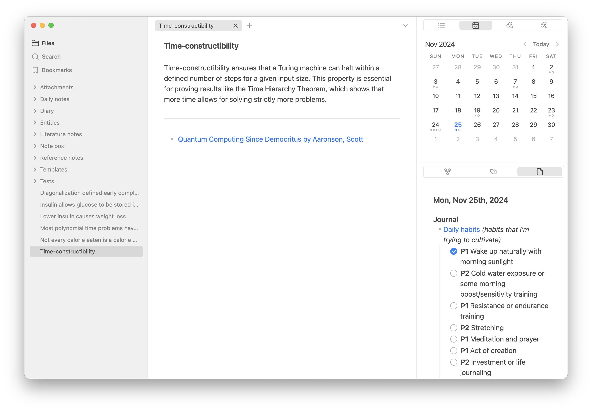

---
tags:
  - tech
  - philosophy
date: 2024-11-26
modified: ""
slug: knowledge-setup
description: Digital longevity is really important to me. This post is about how I've structured my digital outputs, mostly in personal work.
title: My Knowledge Setup
publish: true
image: 
origin: https://paragraph.xyz/@fakhoury/knowledge-setup
series:
---
Digital longevity is really important to me. That is, minimizing the friction in upgrading the interfaces for underlying files and data. This post is about how I've structured my virtual personal work and hobbies in that pursuit.

The concept of digital longevity was recently put into words when I read this post on [File over App](https://rishikeshs.com/file-over-app/), an ode to the power of simple and open formats that are unbiased at the application layer. In fact, this is how most of the computing world works. From intricate hardware to the most abstract software, open standards rule the layers of representation, and culminate in a view on some graphical user interface that is much simpler for humans to use. In fact, I would go as far as to say that a good setup for your digital knowledge [aids a leisurely and playful approach](https://www.personalcanon.com/p/research-as-leisure-activity) to information gathering. It becomes a garden more so than a library. 

At the highest level, I would categorize my outputs into four categories that encompass both my leisure and required time in the virtual world:
- **Communications and transactions.** All of the texts, emails, and social media posts I create, as well as financial transactions (traditional and crypto). I also include chatbot conversations in this.
- **Pictures and files.** Things I capture from the world or things I archive from inbound information.
- **Code**. This roughly includes all projects I've worked on, including things that aren't strictly code, but rather documentation for a project.
- **Writing and notes.** My concerted effort to think through writing. This includes daily scratch notes, diary-style notes to myself, and highlights that become my own atomic notes (via the zettelkasten method).

# More on each category

The first two categories—communications and transactions, and pictures and files—are straightforward to manage for digital longevity. My priority here is minimizing friction and future effort. A basic backup system is sufficient for peace of mind, and on the rare occasion I need to sift through a raw backup, it’s worth the effort.

All of these communications and transactions are inherently stored in the cloud, making them easy to search when needed. Longevity is handled by the platforms. Crypto activity, by its nature, is permanently recorded on the blockchain, requiring no extra effort to preserve. For files and photos, using apps within a big-tech ecosystem keeps things convenient and ensures longevity through massive scale. The key to success here is simplicity: choose tools that work seamlessly and ensure your data isn’t deleted without your knowledge. This approach aligns perfectly with my broader goal of setting up systems that adapt over time with minimal intervention.

## On Code and Projects

Code is where the philosophy starts to come into play. Choosing to use Matlab over Python has profound differences as time stretches on. One depends on a licensed suite of tools to run, often changing and not necessarily accessible to anyone. For example, when I graduated college, I no longer had a straightforward way to run old Matlab projects. My python projects can be run with essentially zero friction. MacOS literally comes packaged with a version of Python! There's a reason why all of the most popular languages are open source.

The other thing to keep in mind with code is dependencies. Often the text you write as "code" is not enough to become a program on its own. Frameworks will juice up your code with necessary injections of libraries and transformations before it is something that can be run (either virtually through an interpreter or literally as machine code). As far as digital longevity goes, I think about how the projects I've created might run as time stretches on. My [epsilon-privacy algorithms](https://github.com/brianfakhoury/privacy-algorithms) are pretty much context free Python code that can be run with a simple `python membership_attack.py`. The Python program will figure out how to run my program. On the other hand, [my new website](https://github.com/brianfakhoury/fakhoury.xyz), built on NextJS, is a bit more complicated. It's a real-life example of production code with serious dependencies to run. The code that I wrote is transformed numerous times into multiple programs, some that run on servers and some that run in the web browser, to create the unified idea of my website. Hundreds of libraries that other people maintain are referenced, and the machine code runs in places that I do not control (i.e. a managed cloud instance and other web browsers). The caveat is that this project is not meant for longevity, the underlying writing is! My website is, in my opinion, a beautiful wrapper of information that I decided to make public. That information is indeed created in what I think is a more timeless format. Let's look at that.

## On Public Writing

Markdown and git. That's my not-so-secret formula for long-lasting writing that can adapt to any future. Markdown is human readable and works phenomenally when translated into more machine-native formats (like HTML). Git is like a digital filing cabinet that tracks all changes to it's contents.

What I found easiest to maintain is to keep my posts in a "[monorepo](https://en.wikipedia.org/wiki/Monorepo)" of sorts that is my website repository. From there, I load [just the folder](https://github.com/brianfakhoury/fakhoury.xyz/tree/master/content/posts) of posts into [Obsidian](https://obsidian.md/) for editing, and git takes care of tracking changes before I commit them in the root of the repository (this is basically the entirety of the publishing process to put a post on my site). Perhaps this is too technical to follow along, so a simpler way to say this is: I keep all my writings in plain text in a folder. The changes to that folder are all stored as a history, which makes sure I know exactly what changes to my site I'm publishing. The folder is copied across the cloud and my computer, but the chain of history ensures consensus on the latest version of this folder, regardless where it is being accessed. When it is accessed, the plain text is transformed into a more visual document that one would expect for writing.

A bonus step for digital longevity is publishing these posts on a permanent storage network like [Arweave](https://arweave.org/). While it's the same plaintext post, putting in on a public ledger that can never be deleted ensures that the data is *available* forever, in a format that will last. As a thought experiment, when posting to a permanent data storage system, you could imagine why a closed format like a `.docx` file might not be great for the long term future (it's not trivial to open it or render it in a different format). Of course the purpose of protecting the information would be served, but only by the power of workarounds to view it in the future, not as natively as intended.

## On Notes

This strategy is replicable, so I use it for my non-public writing and notes. Even though I don't plan on rendering it anywhere, the benefits are still abound. Plain-text ensures simplicity in structure and access, and placing the folder in a cloud directory is plenty of backup. I could use git as well for better history control, but at the moment I don't find that to be a priority. If the size of my notes grows by an order of magnitude or two, I'll reconsider.

Markdown is not the only trick for longevity of notes. After studying the [zettelkasten](https://zettelkasten.de/overview/) note-taking system, I've committed to arranging the notes as atomic units (each one is it's own file) and only using links to create an emergent structure rather than an enforced hierarchy of folders. In the screenshot above, all my actual notes are in the `note box` folder. The connections between them, similar to Wikipedia, create infinite paths to any one note, making the best ideas hard to loose. This method is important for digital longevity, as the linking structure is a meta-file in a way. Links are a better "file format" than cramming lots of ideas into a single note file as relating distant ideas becomes much harder.

Of course my non-public system has a lot more than just linked atomic ideas, such as daily entries and source highlights (see the other folders in the screenshot). But at its core, it will always be flexible, upgradeable, extensible, and lasting. 

# Conclusion

While my system is geared around digital longevity, it also has some cool side effects. First, configurations are silently stored alongside files. For example, my Obsidian themes and preferences are carried in a hidden folder within the folder of all the text files. This removes platform dependency for easily keeping a familiar look across future computers. Another nice effect, specifically with Markdown, is the standardization of formatting syntax. Rather than just being purely characters, Markdown has standardized how images, tables, bold/italic, headings, etc... are written in plain-text. Things like LaTex for math-formatting are also well supported. This opinionated framework on top of plain-text means Markdown is infinitely powerful, and will continue to hold it's own against the closed formats that continue to add features (there's a reason why LLMs prefer Markdown formatting for output).

Perhaps whatever AIs end up using for file formats and such will be the best indicator of digital longevity. Maybe not.