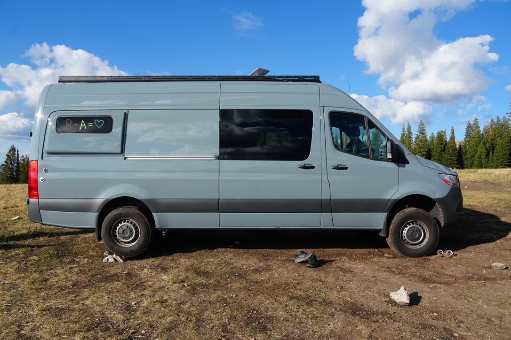
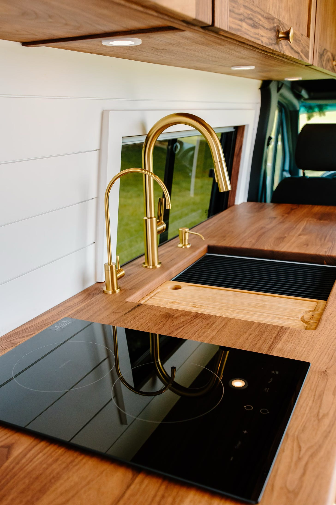
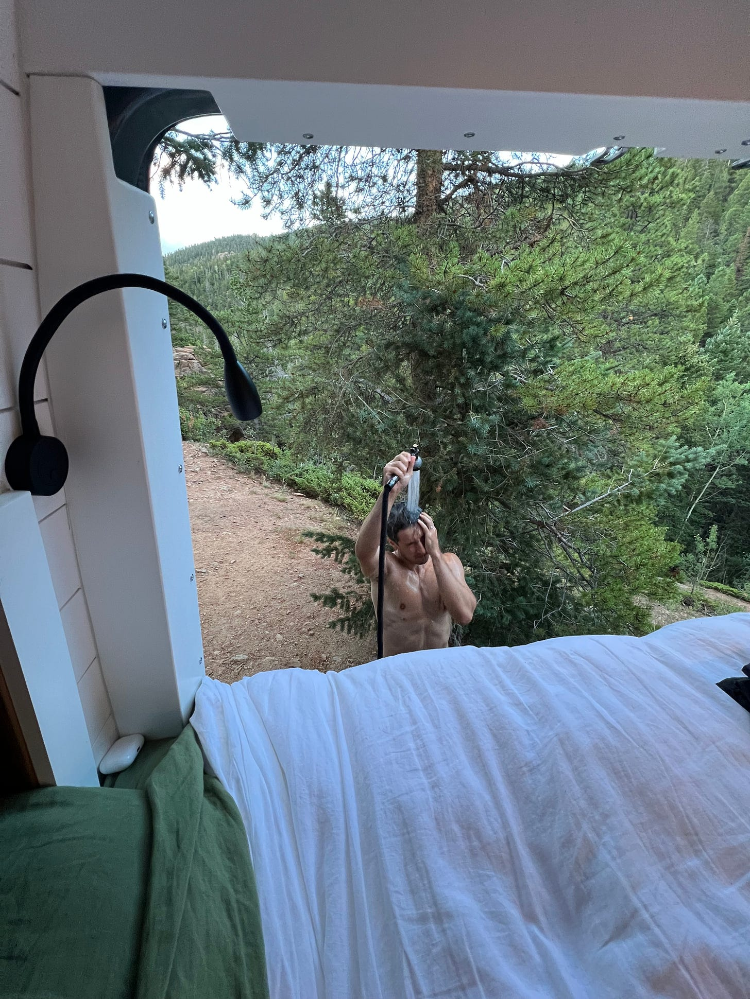
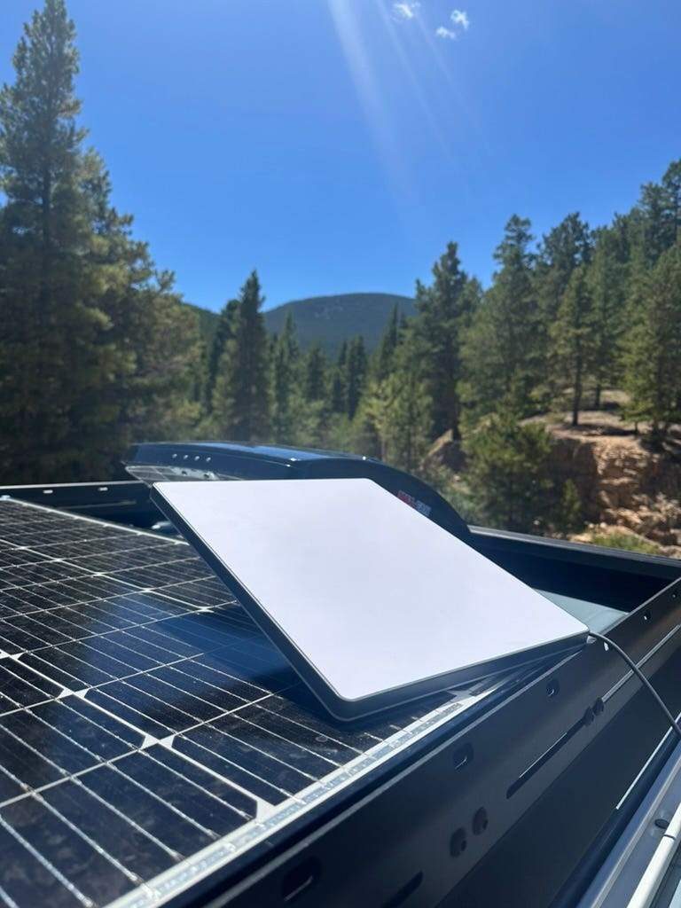
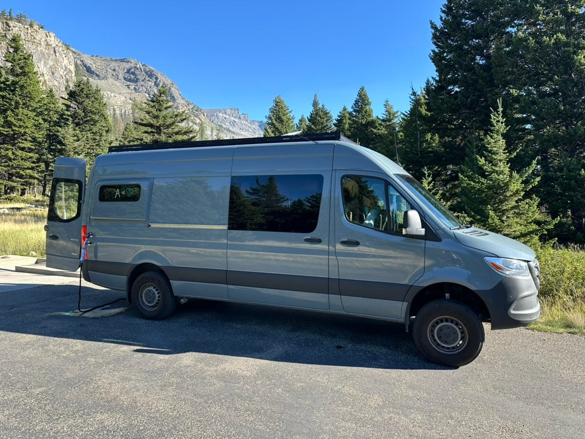
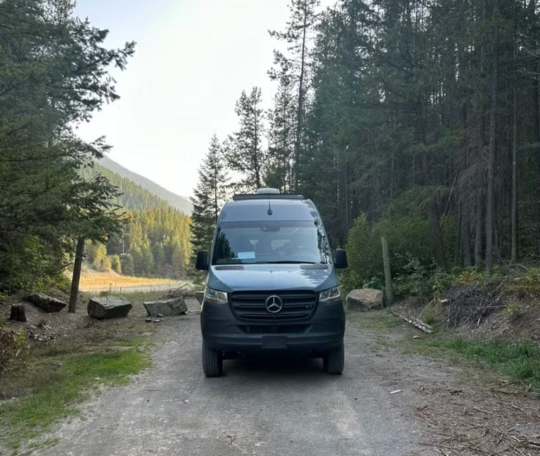
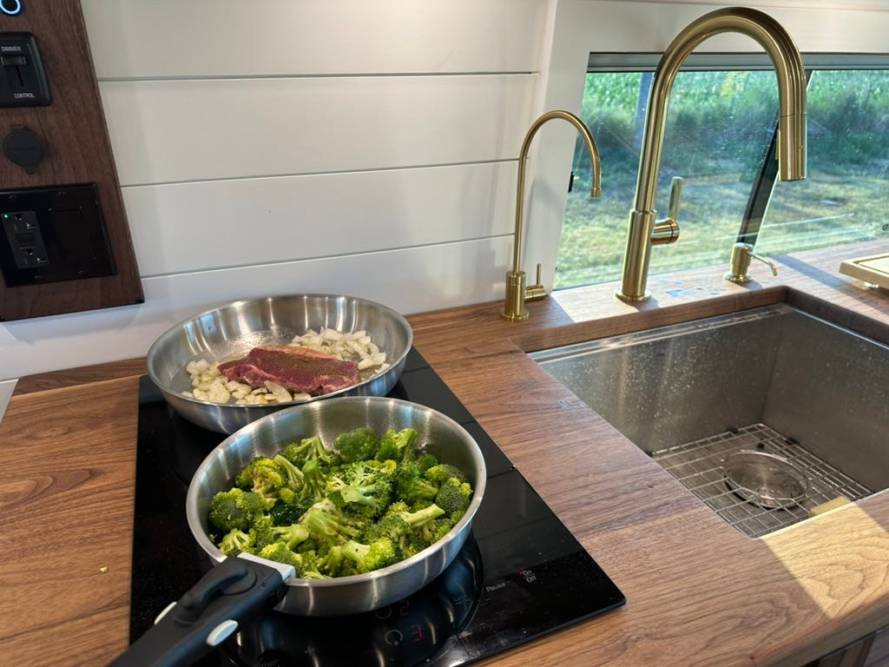

---
tags:
  - van
  - off-grid
  - daily-life
date: 2024-10-12
modified: ""
publish: true
image: images/our-van/365fc147aacc7e5473a517a8ce25c37f_MD5.jpg
slug: our-van
origin: https://rollingtogether.substack.com/p/our-van
description: A reflection on our decision making process in creating our adventure van.
title: "Our Van: Design and Decisions"
series: 
location: Pacific Northwest
category:
  - Adventure
---
When you hear the word "van," perhaps what comes to mind is short of anything exciting. A delivery vehicle? Or maybe a grimy, permanent fixture on some nondescript road. For us, our van is so much more—it’s a beautiful, multi-functional home on wheels, built for adventure. It’s designed to handle rugged landscapes, inspire creativity, give us a cozy place to sleep, shield us from the elements, and provide a full kitchen for daily meals. A well-designed van isn’t just a vehicle, it becomes a livable space that shapes your routine while allowing for endless spontaneity. In this post, I’ll walk you through the design choices, outcomes, and happy surprises that made our van truly special.

## What goals did we have when designing the van?

Some camper vans are built purely for function, designed around hauling loads of outdoor gear. Others serve as hobby projects, decked out with fancy accessories to impress and attract attention on our feeds. Then there are vans that are true homes, where life unfolds day by day. We fall into this last category. In designing our van, seven key factors guided every decision we made:

- Efficient
- Beautiful
- Complete
- Studious
- Clean
- Open
- Off-grid

**Efficient**

I appreciate fuel efficiency, maximizing space, and incorporating clever systems. Vans are compact, and since we spend so much time in ours, we need to utilize every inch. With this in mind, our seating doubles as storage and our countertops and the foot of the bed are fitted with airplane-style cabinets. Much of the kitchenware folds or collapses—think collapsible measuring spoons and detachable pan handles—to maximize storage. The large sink is designed for multitasking, and a built-in drinking water filter and tap eliminate the need for a separate pitcher. We jammed as many solar panels as we could on the van's large roof and our heater siphons just a trickle of the engine’s fuel to keep us warm on cold mornings. Our Starlink provides compact satellite internet access, and by standardizing USB type C across the van, we've reduced the need for multiple cables, instead rotating our devices on just a handful of cords.

**Beautiful**

It's important to appreciate the place where you spend a lot of time, and for me, that includes both the inside and outside of our van. I see three key aspects here: the exterior appearance, the interior design, and the functionality of the build. Choosing the Mercedes Sprinter gave us a van that's visually appealing from the outside. Collaborating with our builder, David, who has a great eye for woodwork and layout, we made the interior cozy and harmonious. Lastly, in selecting the appliances, hardware, and power systems, we created a functional architecture that I continue to appreciate as we use it.

**Complete**

In many aspects of the van, choosing to go 100% rather than settling for 90% made the difference between it feeling like a home and just a vehicle. For instance, having a bed that feels just like the one in a house means I never long for a "real" bed. A fully functional kitchen with a stove, sink, and fridge that don’t require compromise free us to always cook the meals we want. By "complete," I mean the van allows us to live fully, without cutting corners. While we still use outside amenities like a gym shower, it's by choice, not necessity, since we have a rear-detachable shower and an internal composting toilet.

**Studious**

Neither of us enjoys being idle for long, though sometimes relaxing in nature is a welcome change. Being able to work on our jobs and projects was key to making van life viable for us. This led to our decision to use Starlink, design a multi-functional table for our laptops, and include small additions like laptop stands and USB-C power ports directly wired into the van’s DC battery.

**Clean**

We’ve always maintained a clean space, but it’s more than just doing the chores. Cleanliness shaped our choices in appliances, materials, and even daily habits. For instance, we don’t wear shoes on the wood flooring, instead leaving them in the cab area. We chose darker linen sheets that show less discoloration over time, and other features for ease of cleaning—items like the glass stovetop and stainless steel sink.

**Open**

Many vans and RVs can feel cramped, with storage piled up and living areas tucked away. To avoid this, we opted for a high-top van where we can comfortably stand and designed a layout that reserves storage for unused spaces. We also carefully placed windows to frame the outside as natural artwork, but avoided adding too many to maintain some privacy. White walls and ceilings help balance the dark walnut wood, preventing the space from feeling too enclosed, while large back and side doors allow us to open the interior to the vast outdoors in the most scenic spots.

**Off-grid**

This was an obvious priority for us, especially compared to traditional RV setups where you rely on campgrounds for water, electricity, and wifi. Whether we’re in a parking lot, a national forest, or at a trailhead, we wanted the same level of comfort. That’s why we chose a 46-gallon fresh water tank with built-in filtration, 600 amp-hours of battery storage, 500 watts of solar panels, and a heater connected to the van’s fuel line. Living off-grid puts us in control of our own resources. While we don’t have infinite power, water, or wifi, we can manage them efficiently, allowing us to stay self-sufficient indefinitely.

## Daily life

### How do we sleep?

We sleep in a queen bed with a memory foam mattress, just like in a regular home, using linen sheets and a big fluffy duvet. It’s a bit shorter than a normal queen bed, but we installed “flares”, which give us a few extra inches in the van’s body and allows us to sleep across the width of the van. The alternative would be sleeping across the length of the van, so we’ve saved some space and added ventilation with our choice of the flare plus window combo. For ventilation, we set one fan pulling air in and another pushing air out, speed-adjusted to keep the temperature comfortable. In the mornings, we have the heater programmed as a “heat alarm” that helps us stay on top of changing temperatures. We use insulated window covers for both privacy and to regulate the temperature at night. Each side of the bed has an adjustable reading light so that we can wind down with a good book before bed.

### How do we park?

Parking the van is simple, often easier than finding the perfect spot! We just stop the vehicle (accounting for flatness of the area), put up the window covers for privacy and insulation, and set up Starlink on the roof for internet access. Within minutes, we’re ready to settle in for the night or start working.

Finding a parking spot is a mix of intuition and planning. In towns, parking is more about convenience than aesthetics—it's where we stop for daily routine things like going to the gym, picking up groceries, or finding a coffee shop or library to work from. For overnight stays in towns, we often rely on places like Planet Fitness, Walmart, or Cracker Barrel, where we can park, sleep, and then continue on our journey. When we're outside of town, the best camping in my opinion is known as "wild camping.” Usually found in national forests, it’s secluded, pristine, and free. The iOverlander app is an invaluable resource in this regard, with a database of other travelers’ experiences that helps us find quiet, safe spots where we can settle in for a day or two.

### How do we cook a meal?

Our kitchen setup includes an induction stovetop, which uses roughly 10% of our battery capacity to cook a full meal. We use pans and pots with removable handles to save space. We cook with fresh, whole foods, keeping lots of frozen meat and a well-stocked pantry for variety. After meals, we wash dishes by hand (in what might be the biggest sink I’ve ever had), then we either eat at the pullout table inside the van or outside at a foldable table, depending on the weather and location. A cutting board and rollup drying rack are custom fit to the sink to sit flush and offer multi-functional purposes for all of our cooking and washing needs. Often, a dinner has enough leftovers to put in a glass container and store in the fridge for lunch the next day.

### How do we use the bathroom and shower?

When nature calls, we usually use public restrooms or the great outdoors. We also have a composting toilet for emergencies or when we’re feeling lazy. Showers are usually taken at the gym, but if we have extra water and privacy, we use a quick-connect outdoor shower at the back of the van for a quick rinse.

### How do we organize everything?

We use packing cubes for our clothes and keep deep storage areas for infrequent but necessary items. Daily essentials like clothes, food, and dishes are stored in cabinets, while miscellaneous items are kept in cubby cubes above the cab, organized by category (tech drawer, gym bag, toiletries). The "garage" space holds larger items like the laundry bag, foldable chairs and tables, the water hose, and window covers.

The fridge is extremely large for this type of build, offering 200 liters of space including a freezer. This means we don’t have to get too creative with organizing food, and instead can focus on filling up for over a week’s worth of ingredients and meals.

### How do we stay off-grid?

The limiting factors that force us back onto the road are, in order: water, battery, fuel, food, gym (for showers/weight training), and laundry.

Minimizing water usage is pretty straightforward, but in order to further stay off-grid, we balance our power usage by considering the availability of solar energy and how much driving time we have. Driving triggers power draw from the engine’s battery to the batteries that power our appliances and lights. For reference, if we’re stationary without any engine power, we can probably make it three days before running out of battery. If we position the van for optimal sun exposure, we could stretch the power another few days.

Starlink is how we stay connected. By positioning the incredibly small satellite terminal on the dashboard or roof for an unobstructed view of the sky, it feels like we’re on a normal home wifi connection

Planning ahead, we fill the fridge and pantry with food, the van’s tank with diesel, and try to be thoughtful around exercise and laundry (which we can extend with some sink laundry).

All in, we can go 1-2 weeks off-grid at a time if we need. In practice, we might spend 3-4 days off-grid as moving between places offers the chance to refill these resources, and we take it.

### What modifications did we make to the van’s frame/exterior?

We installed a roof rack to hold the solar panels and added ventilation fans to the roof. It’s a functional change, but also adds a level of ruggedness to the overall van aesthetic. The van also has ports for water intake and overflow, as well as exhaust ports for the heater and composting toilet. We added a grey water tank under the van beneath the kitchen, flares for extra sleeping space, and two more windows to improve airflow and natural light. Beyond that, we’ve kept the exterior relatively simple.

### How do we hang out in the van

Relaxing is important for a balanced van life, as it’s all too easy to get caught up in the constant movement and chores. For movie nights, we set up a laptop on a riser at the foot of the bed and settle in for the night. We often work at the pullout table (pictured above), enjoying views of the beautiful places we visit while locking in to our work and projects. The front seats swivel around to face the living area, providing extra seating, and the couch offers a cozy place to lounge. If we’re feeling like being outdoors, we bring out our camping chairs to enjoy the surroundings.

### Bonus Visuals

## Conclusion

We’ve toured the nature of our van, from the thought processes to the practicalities. Daily life in unique context is a wonderful window to open sometimes, though it’s just a model. What we experience is hard to put in words, but trust me reader, it’s wonderful. Should you ever consider spending time in your own van, grab the idea and consider it thoroughly. You will be surprised how rich it is.

## In Depth, an Addendum

The first draft of this essay began by detailing every factor we encountered during the 16-month process of building the van. However, after reviewing it, I realized that most readers may not find such a granular account useful. Operating manuals aren’t the best beginner content, and so I quickly restarted in a different direction. Still, for those who are curious, I’ve kept some of that detailed information as an addendum below.

### The Foundation

Every van starts out as a basic truck platform with an empty aluminum shell sitting on top. The decisions made at this foundational stage have a profound impact on the final build and are often difficult to change later, as they become essential to the structure of the vehicle. Here are the key considerations we faced when laying the groundwork.

**Brand.** The three most popular van models (as of 2024 in the United States) for van-life builds are the Mercedes-Benz Sprinter, Ford Transit, and Dodge Ram Promaster. _As a fun aside, you can often notice the same platforms under different names when you’re in another region of the world._ Each brand offers different sizes and features, but I chose the Mercedes Sprinter. While all three would have worked, I found the Sprinter to be the most visually appealing, with a sense of adventure in its exterior design and an interior that shares some of the luxury feel of Mercedes’ cars. Although the Sprinter comes at a higher cost, I see it as an investment. It holds its value well, and since I take meticulous care of my belongings, this was important to me.

**Size.** Vans come in a wide range of sizes, from mini-vans that are smaller than an SUV to buses capable of transporting large groups of people. The ideal size for van life depends on how many people will live in it, the activities you plan to do, and the places you want to access. Since there are two of us, and we wanted enough indoor space to sleep, work, and cook without relying on outdoor setups, we opted for a “high-top” van that allows us to stand up fully, as well as a long wheelbase to fit a queen-sized bed without sacrificing kitchen and seating space. In Sprinter terms, this means we chose the high-top, 170-inch wheelbase model. The alternatives would have been a combination of low-roof, 144-inch wheelbase versions, which offers about 3.4 feet less living space. Despite its size, the van still fits into standard parking spaces and handles well in tight driving situations, unlike traditional RVs, which are bulkier and less maneuverable.

**Engine.** Not all engines are created equal, and vans often push beyond the realm of consumer vehicles into commercial-grade territory. Many vans, including the Sprinter, come standard with a diesel engine, although gas-powered options have been available in the past. Initially, I considered saving money by choosing the gas engine, but after researching, I realized why diesel engines are so prevalent in heavy-duty vehicles. Diesel engines are more fuel-efficient, last longer (often over a million miles), and deliver better power output when needed. While I would love an electric van, the technology is nowhere close to viable for a vehicle of this size. The energy density of diesel is about 12.9 kWh/kg, while the best batteries today only reach around 0.3 kWh/kg (though it’s not apples to apples). When you consider the power output needed, this makes a fully electric van impractical for now. Thankfully, opting for all-wheel drive (AWD) required a diesel engine, which sealed the deal for me. The OM654 diesel engine in the model I chose is efficient, giving us over 20 miles per gallon and a range of nearly 600 miles on a full tank, even when fully loaded. This is impressive considering the van weighs over four tons, defying the stereotype of diesel engines as fuel-guzzlers.

**Class.** The size of the van doesn’t determine everything; its class also affects its carrying and towing capacity. This is usually indicated by a number after the model name, such as the Sprinter 2500. Similar to trucks, a higher number means greater payload and towing capabilities (e.g., a Ford F-250 vs. F-150). I chose the Sprinter 2500, which has a payload capacity of over 3,400 pounds—more than enough for our needs. Higher classes, such as the 3500, come with dual rear wheels for additional support, but I preferred to avoid the extra bulk to keep the van more agile. With all-wheel drive, there’s additional ground clearance for off-road adventures while also having additional traction support and just looking cool.

**Factory Additions.** Before taking delivery of the van, I opted for several factory upgrades that, while not essential, significantly improve the experience. These include blind-spot detection for safer lane changes, swivel seats to enhance the living space, a 360-degree parking camera for easier maneuvering, a larger screen with Apple CarPlay for more functional driving, an electric parking brake for added security, and a side-door assist to make the heavy sliding door easier to close.