---
tags:
  - life
  - pets
date: 2025-04-18
modified: ""
publish: true
image: images/rouglass/header.png
slug: rouglass
origin: 
description: This is a remembrance of Rouglass — a cat whose quiet presence left an outsized mark on the lives he touched.
title: "Rouglass: A Memoir"
series:
---
This is a remembrance of Rouglass — a cat whose quiet presence left an outsized mark on the lives he touched.

Pronounced **RUG-luss** (rhymes with _Douglass_, sounds like “rug-less”, IPA: /ˈrʌɡləs/).

---

# The Early Days

In 2022, while living in my one-bedroom brownstone apartment, I unexpectedly became a cat foster. A few weeks earlier, my future wife and I had decided it might be fun to have a cat around. This was a decision that, for those who grew up with animals, doesn’t require much deliberation. We signed up to foster, and to our surprise, were quickly matched with a cat named _Ruggles_ — just as I left the country on a work trip. On March 23, Ruggles arrived at the door of my Boston apartment.

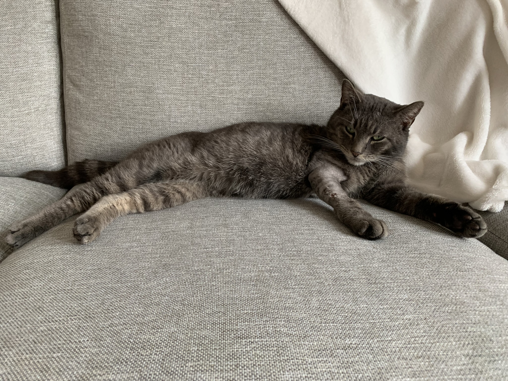

Though I’d grown up with animals, both dogs and cats, this was my first time caring for a cat of my own. I was excited, but it felt like a passing moment, not the start of something lasting. I didn’t expect we’d grow close.

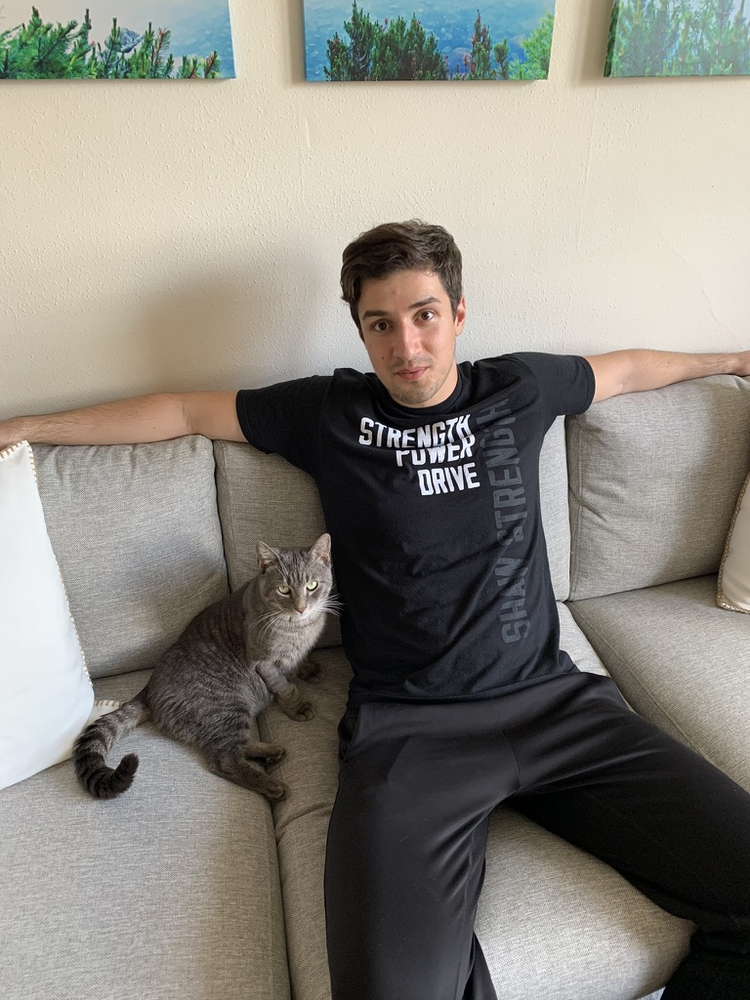

He quickly took to the apartment and its inhabitants. Friendly, curious, and sociable. And for a cat, genuinely funny (more on that later). It was obvious almost immediately: Ruggles was great. It didn’t take more than a day or two to figure that out.

On his name, I'm not sure when we started calling him *Rouglass*, but it was fairly soon after we got him. I looked at the letters one day and figured the obvious mispronunciation of it could sound like the name Douglass. For whatever reason it stuck. The name's carefree nature fit the bearer. His original name is left to the reader as a piece of Boston trivia.

Rouglass filled out fast on his new diet, trading his street-cat lankiness for the roundness of indoor life. You’ll see it in the photos. I’d never been in charge of feeding another creature, so figuring out what to buy, how much to give, and whether it was working was new territory. Pets don’t talk, not really, so it felt like guessing in the dark. But the fading of bones under his fur was reassuring. The only snag was a bout of skin allergies that led to a vet visit. We never figured out if it was the food, the litter, or something else. After some tweaks and time, he was fine.

Another early observation: Rouglass loved the stirrings of morning. While cats don’t exactly sync with human sleep schedules, he mostly kept quiet through the night (at least in the first days). At dawn, he came alive. Almost the moment I began to stir, he’d leap onto the bed, angling for attention. Over time, I realized the trigger wasn’t sound or motion; it was the appearance of hands emerging from under the covers. That became his signal. Eventually, I took to keeping my hands hidden just to steal a few more minutes of rest before Rouglass made his move.

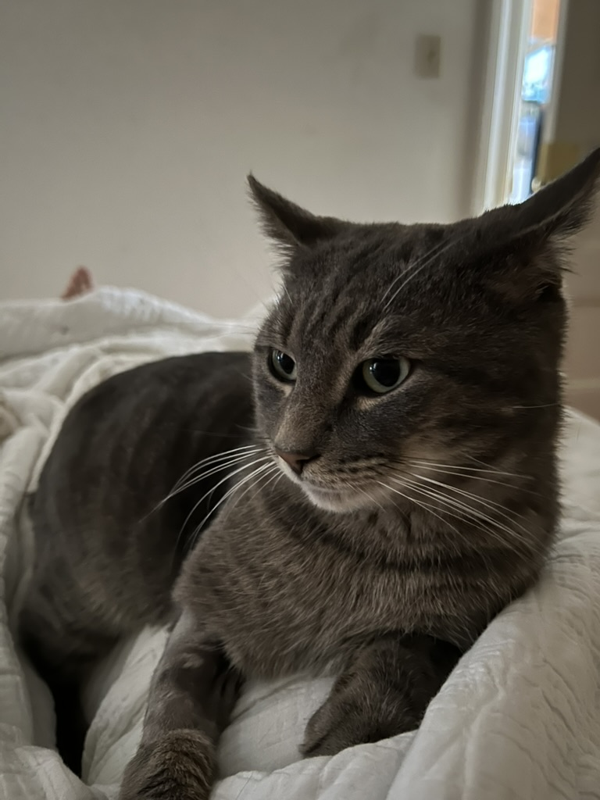

On the nights he chose not to lay low, I’d sometimes wake to the unmistakable sound of self-directed chaos, usually involving one of his louder toys skittering across the floor. There’s no good reason a cat needs to be running laps at 3 a.m., but Rouglass never felt the need to explain himself. I’d get up, half-asleep, track down the offending ball, and stash it somewhere out of reach. Most nights, that was enough to restore the peace. As for me, I learned the art of patience. When it's so easy to be irritable at the odd hours of the night, I could practice letting it go.

# Settling In

It’s hard to overstate how devoted Rouglass was to the art of lounging, especially in moments of perfect stillness. He seemed to sense when the air had settled, when the world within the four walls had gone quiet enough to trust. Only then would he ease his way over, curling up beside you. Or just as often, draping himself across you with quiet confidence.

He knew implicitly what is often shrouded to us in a busy world: when nothing is pulling at you, enjoy the moment.

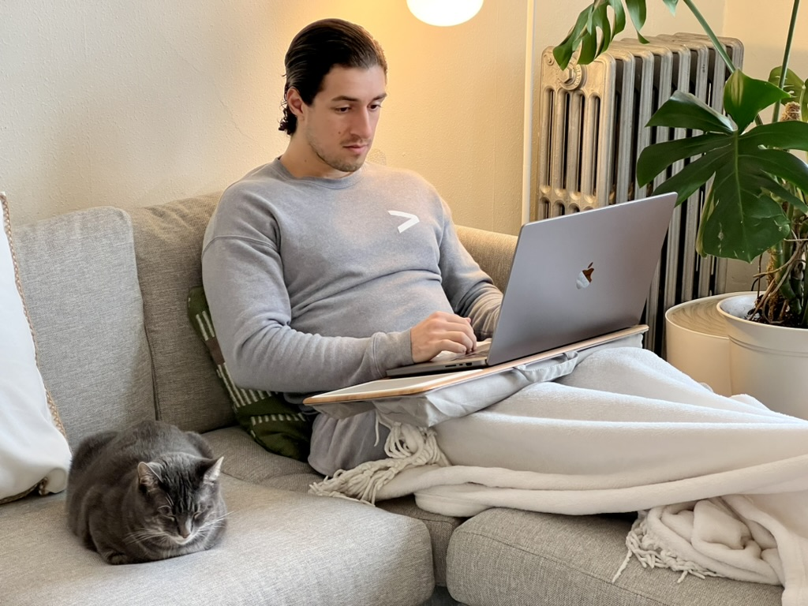

In our small apartment, I always wanted Rouglass to get the most out of the space. I figured that an open window, something only moderately interesting to a human, must be a front-row seat to the world for a cat. He could sit safely and watch it all go by. The problem was that my windows opened onto nearby railings and rooftops, a tempting invitation to go further. I solved this interim problem by setting up a simple anchoring system and a leash. This meant he could safely explore outside the window, but not get too far. It was a sort of way to walk him. At the time, I did not calculate the impact it would have on his confidence around open windows.

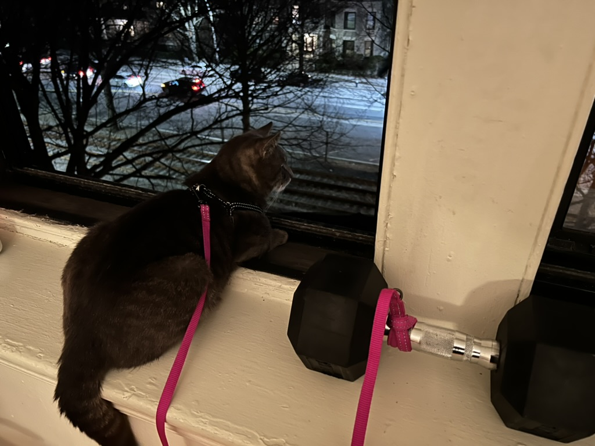

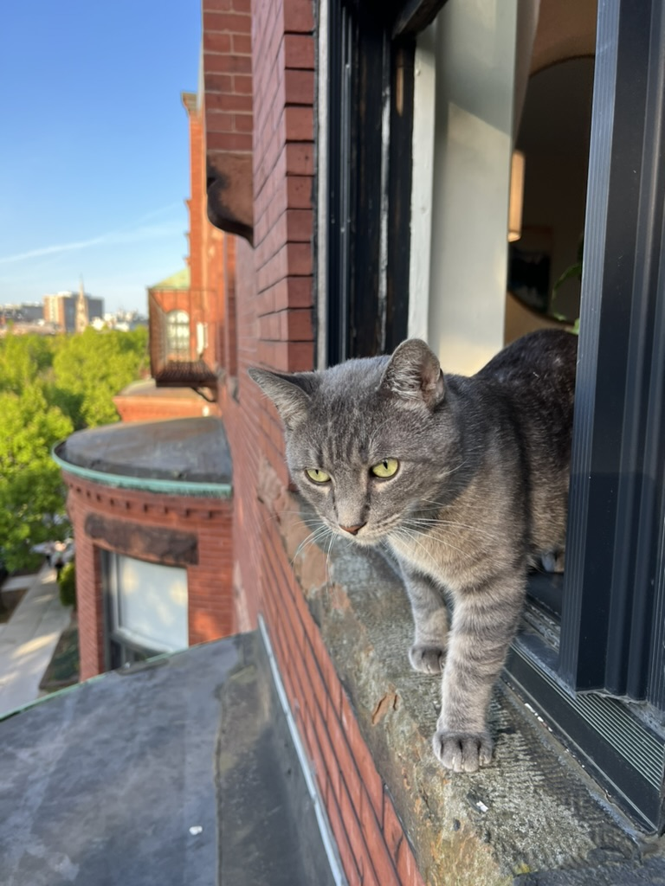

Rouglass had a playful streak that could surface at any hour. You’d hear the clatter of a toy or the thump of something knocked loose, with no warning and no real reason. It never felt intentional. He wasn’t acting out of boredom or bad intention. Rouglass didn’t even know what intentions were. He just followed whatever small impulse drifted across his mind and into motion.

One of his stranger habits was his use of the wall. He’d back up, position both hind legs high against the baseboard, and pause like a coiled spring. Then, with total conviction, he’d launch himself forward, usually at a toy but sometimes at nothing at all. It was athletic and absurd, both precise and chaotic. Watching him do it, you got the sense that this was a cat who trusted his surroundings to hold him up, even when it made no sense.

He had a particular fondness for hands. What began as a gentle petting session could shift without warning into something closer to a duel. He’d deliver a testing swat, and suddenly we were locked in. My hands would dive and retreat, feint and strike, while he tracked them with single-minded intensity. It wasn’t aggression. It was more like a shared performance, a small ritual that let us meet somewhere between his instincts and mine.

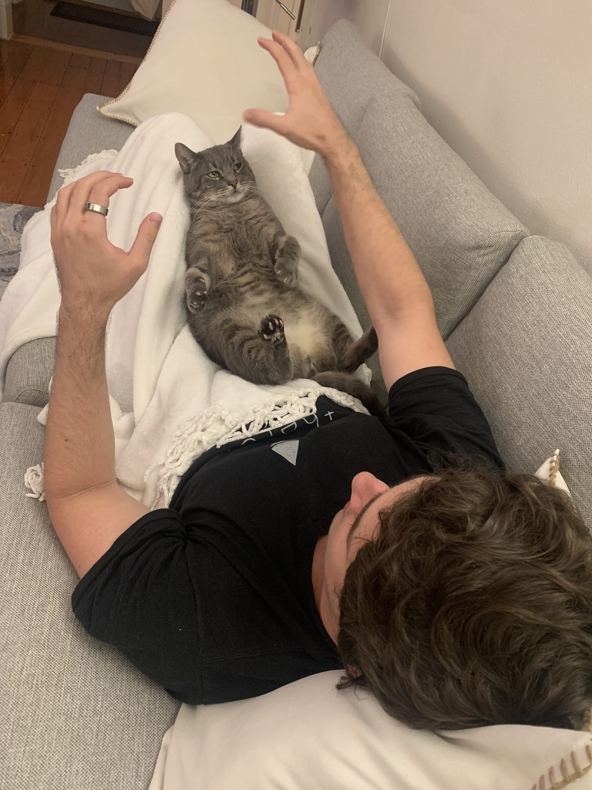

In 2022, as the last stretch of the pandemic blurred into routine, I spent most days alone, working online. The apartment was small and quiet, and Rouglass’s presence, though understated, broke up the stillness. He moved through a steady rhythm of sleeping, grooming, and occasionally just sitting there, watching me. He didn’t need much, proximity was enough. In a space that felt static, he brought a kind of quiet motion. From his side, it must have felt like a good arrangement. Long stretches of calm, the occasional meal, and every soft (or hard) surface claimed as his own.

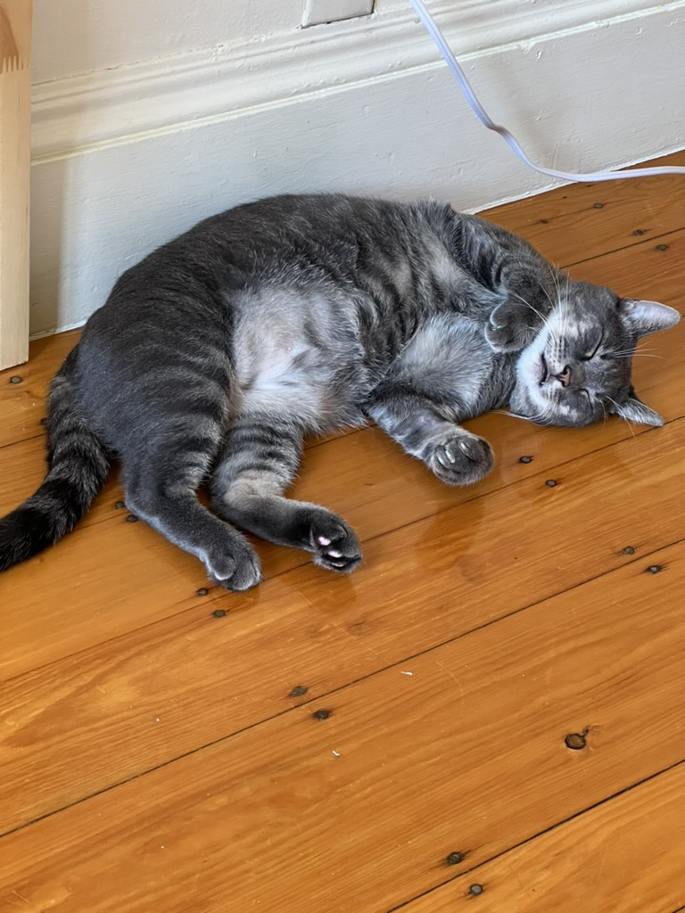

Rouglass had a clear preference for messy beds and cluttered floors, choosing to sprawl across uneven piles of clothes or half-crumpled blankets like it was a luxury. To my human eye, it looked wildly uncomfortable, but to him, it seemed ideal. We noticed it often and always pointed it out with the same amused tone, as if it were the first time. One of his favorite habits was placing a single paw on the wall or against an object for support, a detail so specific that we still talk about it. His physicality in general was endlessly entertaining. During grooming, he’d contort into improbable shapes, legs reaching straight into the air or tucked behind his back, turning his body into something loose and amorphous.

This is one of the things I’ve come to appreciate most about cats. They live close to first principles. If something is possible, they do it. There’s no hesitation, no second-guessing. And while that occasionally backfires (especially on slippery floors) it mostly seems to work in their favor.

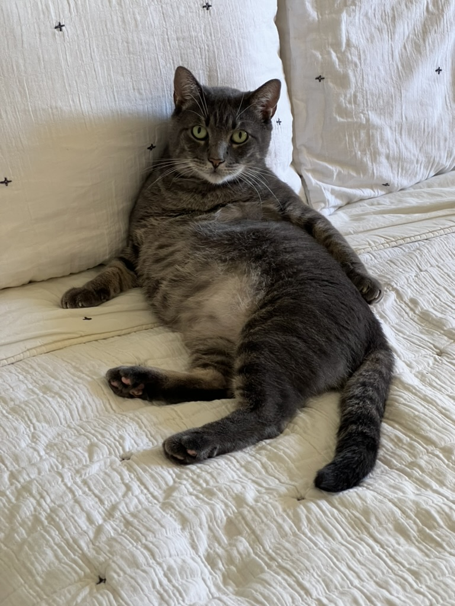

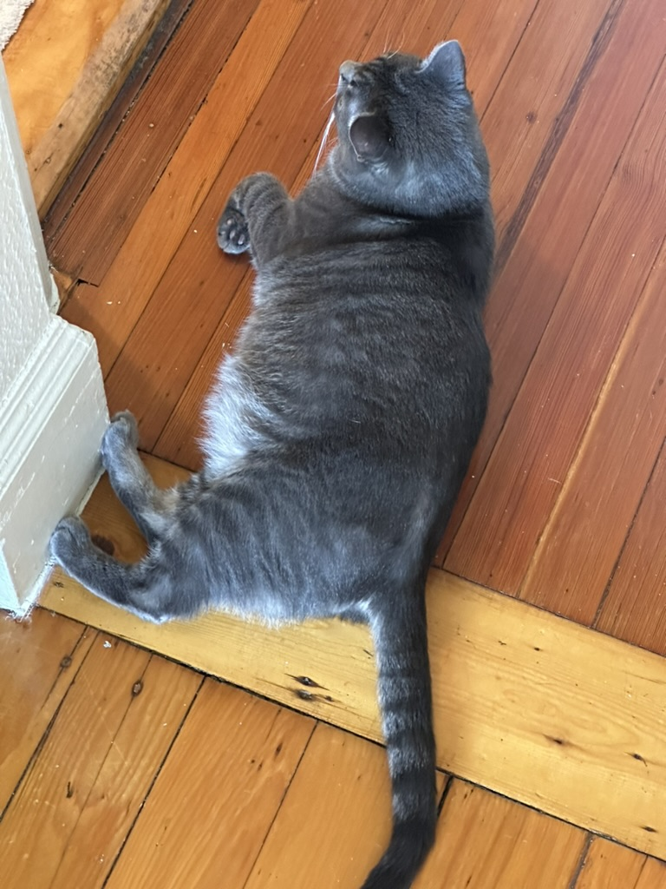

One of Rouglass’s signature expressions was what we called *airplane ears*. This was the phenomenon of ears flattened outward in a way that always made us laugh. I found them especially thrilling when paired with the wide, dilated pupils that signaled something was about to happen. We called those moments *large eyes*. It was his hunting mode, triggered without warning. And when he moved, he made what I called *Mario sounds*: small, effortful *mrrpps* that seemed to puff out of him as he leapt or darted across the room.

Most of the time, he was still. Sleeping, grooming, or just draped across the floor like a rug (more or less). But when play took hold, it was total. No hesitation, no transition. He’d go from heavy-lidded calm to full-speed pursuit in an instant. His favorite toys were always the same: long poles with paper strands or fronds at the end. A single rustle, and he’d launch, every part of him alive with purpose. It was like watching instinct snap into place.

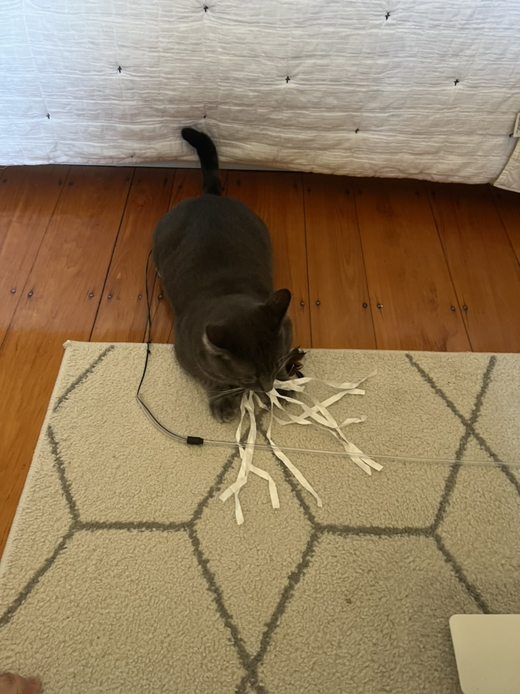

One day, a fellow cat unexpectedly appeared, a neighbor’s pet who had wandered into the stairwell and gotten lost. We brought her in while figuring out what to do, unsure how Rouglass would react. He walked right up, gave her a polite sniff, then calmly sat down and watched as she moved through the apartment. No hissing, no posturing, no need to assert anything. He simply observed, quietly attentive, following her from room to room without ever seeming bothered. He didn’t lose interest, but he never got worked up either. There was no tension in his body, no edge to his presence. He was at ease. This was his space, and he was generous in it.

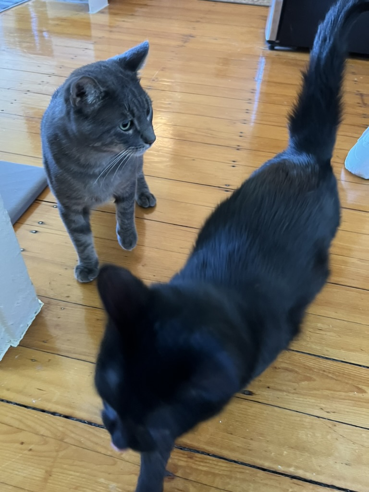

One holiday season, my (future) wife and I had a lot of separate travel coming up, and it did not make sense to leave Rouglass alone in Boston, so I brought him to my parents' house in Texas for about a month. After slowly being introduced to the big new house, he quickly acclimated and enjoyed increased range. This was also at the time that I rescued Gloria, a gray kitten. This was perplexing to Rouglass as she was not dangerous but she was unpredictable and always wanting to play. They eventually became good friends after his skepticism subsided.

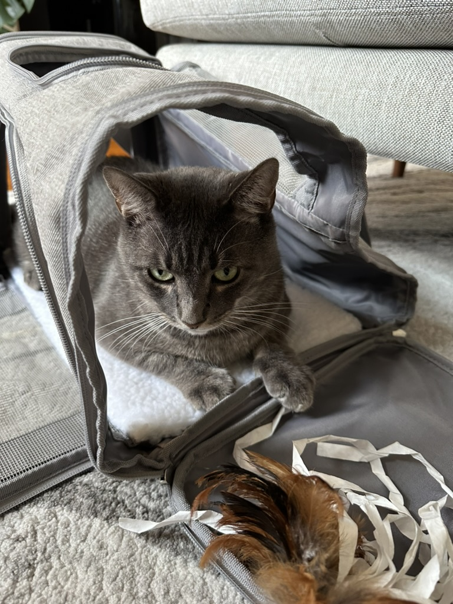

Before his trip to Texas for the holidays, Rouglass had grown accustomed to being the king of the house. Though lonely, he enjoyed supremacy. In Texas, this was no longer true. He had to contend with dogs and other cats, both unpredictable and worth keeping an eye on. When once he could lay in certain peace, he now had the looming worry of the chaos of dogs running in and transforming a moment into mayhem. He made the intelligent move of forming his cabal, an alliance of gray cats. Something that would pay dividends when he would return to Texas later the next year.

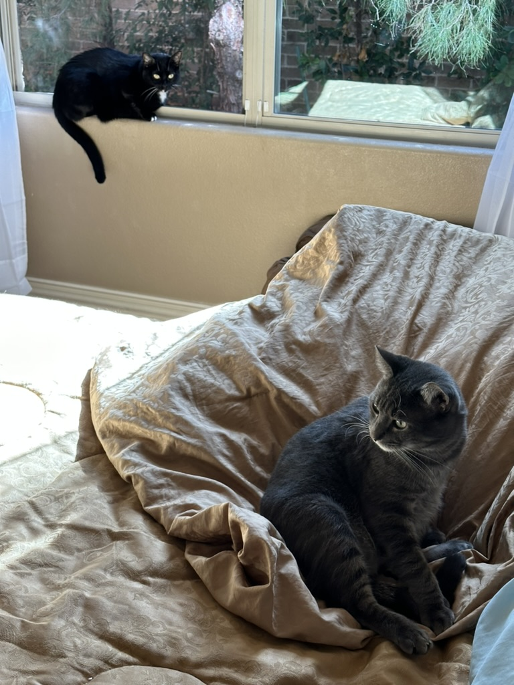

Rouglass was not much of a traveler. Even on quick drives to the vet in Boston, he was anxious and unhappy. Being on an airplane was not any easier, but he managed to spend hours in a little carrier as he moved thousands of miles. We had a chance to show Rouglass [our van](/our-van), both before and after it was built out. Both times, he was very timid and obviously wanted to leave. That's okay, he just never liked being in vehicles. Before bringing him back to Boston, I went to a vet and got some drugs for the plane flight back to mitigate some of the anxiety he had on the way down. This resulted in the famous "Woozy Rouglass", a picture that now lives printed on a t-shirt of mine.

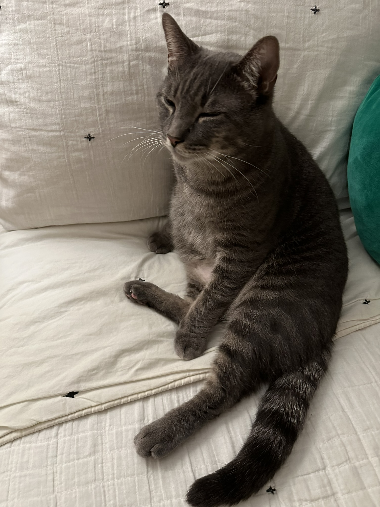

Back in Boston Rouglass popped back into his routine within hours of setting foot in the apartment. In fact, there was no perceptible change that I could detect. 

Rouglass was often in a superposition of disinterestedness and attentiveness. His expressions might tell you that he could give more care, but that he was saving some in the tank. Yet there was never a time when he didn't have every small movement, down to the insect, registered somewhere in his brain.

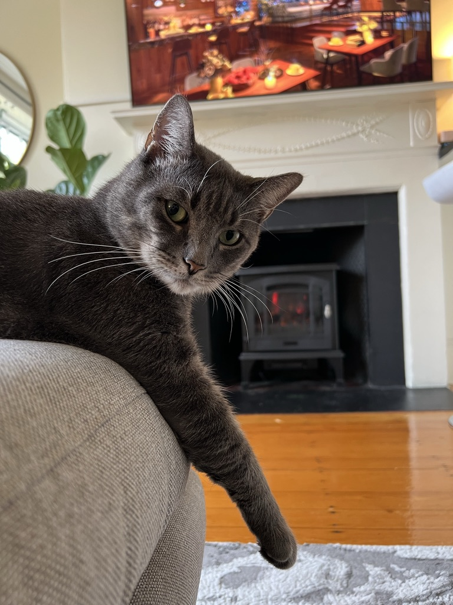

# Transitions

Rouglass grew to settle into our lives, in the way where you no longer separate the responsibilities and novelty of someone being around. He grew to be there, consistently as cats often are. Still we introduced new things, but by and large, he was just part of the family.

One time my mother suggested we take him outside so that he can enjoy grass. When we took him out behind the apartment, he ate some of the grass. So naturally we bought a small grass-growing box made specially for cats to eat indoors, which at first he was scared of but quickly became a lawn mower and chopped down every strand. Stuff like this is the most surprising things about cats, it's hard to predict with certainty what will and what will not be enjoyed. You are often surprised toward the mundane, such as the love of sitting on a messy pile of cables or chewing on grass.

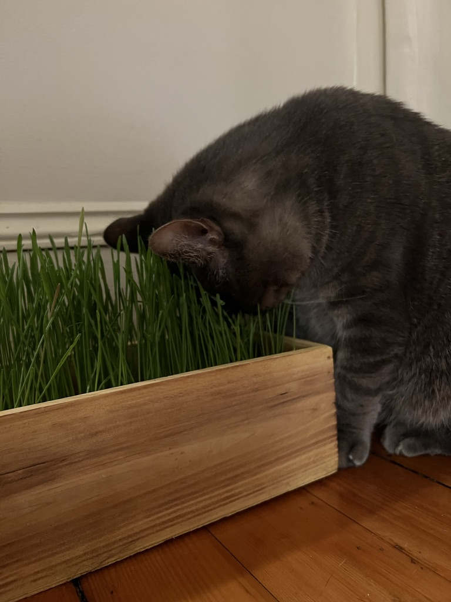

Rouglass had a fondness for a small ottoman in the living room, often lounging on top or tucked beneath it. When he disappeared underneath, we called it his garage. The nearby rug, with its wavy gray pattern, offered the perfect camouflage. Rouglass would blend into the floor so naturally it was like he’d become part of the design.

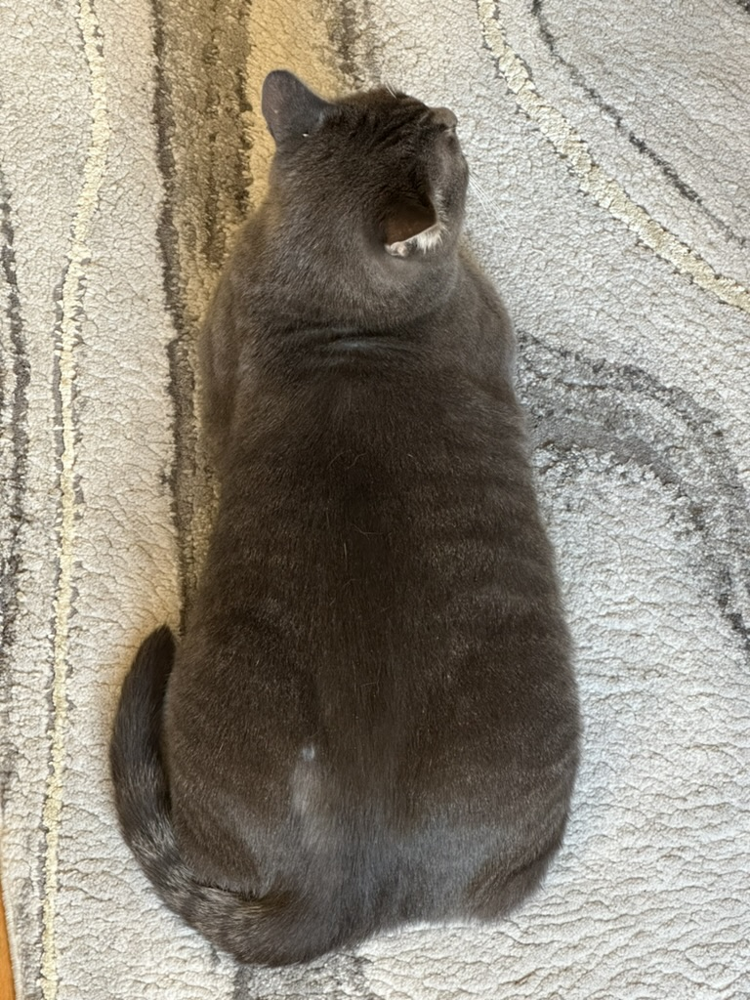

Rouglass had no shortage of quirks. Every time I showered, he’d trot into the bathroom without fail, even coming between the curtain and the liner, and he would playfully jump and try and get you through the translucent liner. One time we got some catnip, and he loved it. The best mode of delivery was putting it inside a sock, just out of reach but easily detectable. He would roll around and use his front paws to rub the sock against his face with all his might. The idiosynracies were never ending. I don't think a lifetime with a cat would fully reveal the underlying pattern to their behavior. There's either known, registered behaviors, or unknown behaviors. You will never know what that day will hold.

Rouglass was always part of the celebrations at home, especially birthdays. On one of Abi’s, he even got a gift of his own from her mother: a handful of tiny, furry mouse toys. He loved them. Most eventually found their way under the fridge, so the number in circulation was always changing.

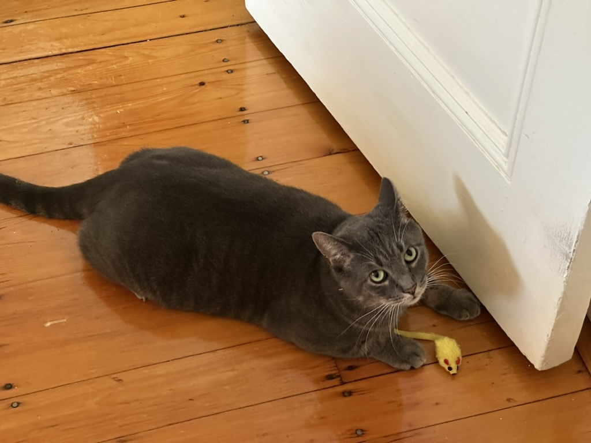

It was never a top priority, but we made an effort to give Rouglass the occasional break from the close walls of the apartment. One summer afternoon, we brought him along on a picnic to a nearby park. He rode in his carrier, uneasy but quiet, peering out at the passing world. Once there, under the wide canopy of trees and in the hush of shaded grass, he began to settle. The breeze carried new scents, and he watched the movement of leaves and passersby with cautious interest. It wasn’t dramatic, just peaceful — the three of us in a small pocket of green, sharing the peace. That day lingers in my memory with clarity, like a pressed leaf between pages.

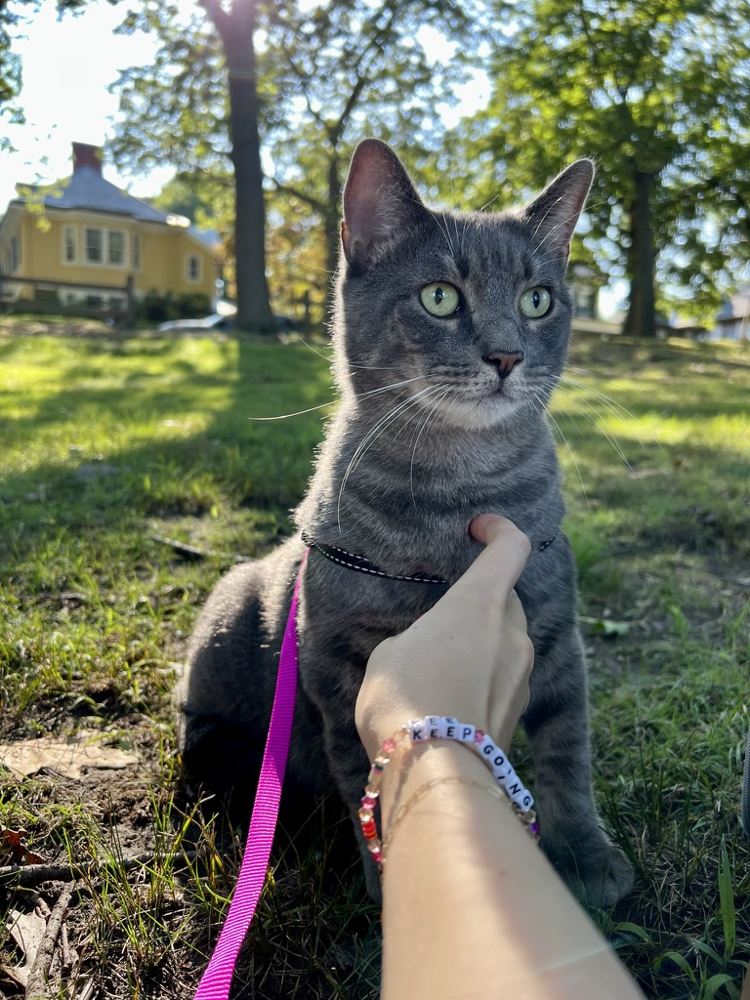

About a year after we got Rouglass, life began to shift in big, overlapping ways. We weren’t heading to a single destination, but navigating a tangle of transitions — a wedding, a new van, new jobs, cross-country moves, travel. It was all happening at once. To make the logistics manageable, we decided Rouglass would return to my parents’ house for a while, a temporary stay until we found our footing and landed somewhere more stable.

The process of packing up and leaving Boston was a slow, deliberate one; and, as ever, Rouglass took it in stride. There was no protest, no visible confusion. As the apartment gradually emptied over the course of a few weeks, his routines stayed the same. When my dad flew in to bring him back to Texas, Rouglass made the journey without fuss, returning to familiar grounds.

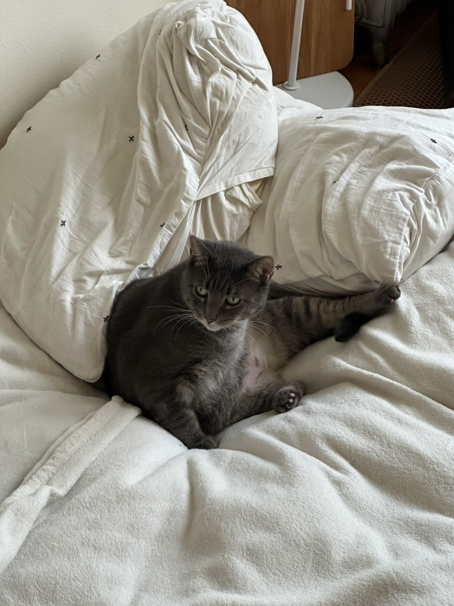

# Later Life

When we first brought Rouglass home, he was estimated to be about a year and a half old, still soft around the edges, not quite grown into himself. By the time he arrived in Texas, he was nearing three: fully grown, self-assured, and quietly dignified. Among the other cats, especially the younger ones, he held a kind of unspoken seniority. He never sought it, but it settled around him all the same.

Like most indoor cats, Rouglass couldn’t be trusted to roam freely. You never quite know what instincts have dulled, or which ones were never there to begin with. We clipped an AirTag to his collar, a simple safeguard that gave him a measure of freedom. In time, he took to spending long hours outside, lounging in the backyard shade, watching the breeze move through the trees. It suited him. And inside, the lighter load on the litter box was appreciated.

Once he lived apart from us, visiting him became a small joy of its own. When we were in Austin, it meant a drive. When we were circling the country in the van, it was a planned stop. From California, it meant a flight. No matter how we got there, the moment we stepped into that house, we looked for him. And he was always there — a little older each time, but the same at heart.

We learned that the Rouglass we knew best — calm, curious, quietly affectionate — only fully revealed himself behind closed doors. Out among the other animals, he was more cautious, more alert. But in the hush of a bedroom, with the door clicked shut and the world held at bay, he returned. He’d stretch out like he always had, eyes half-closed, and bat softly at our hands like no time had passed. Those moments felt like something preserved, something small and golden, tucked away just for us.

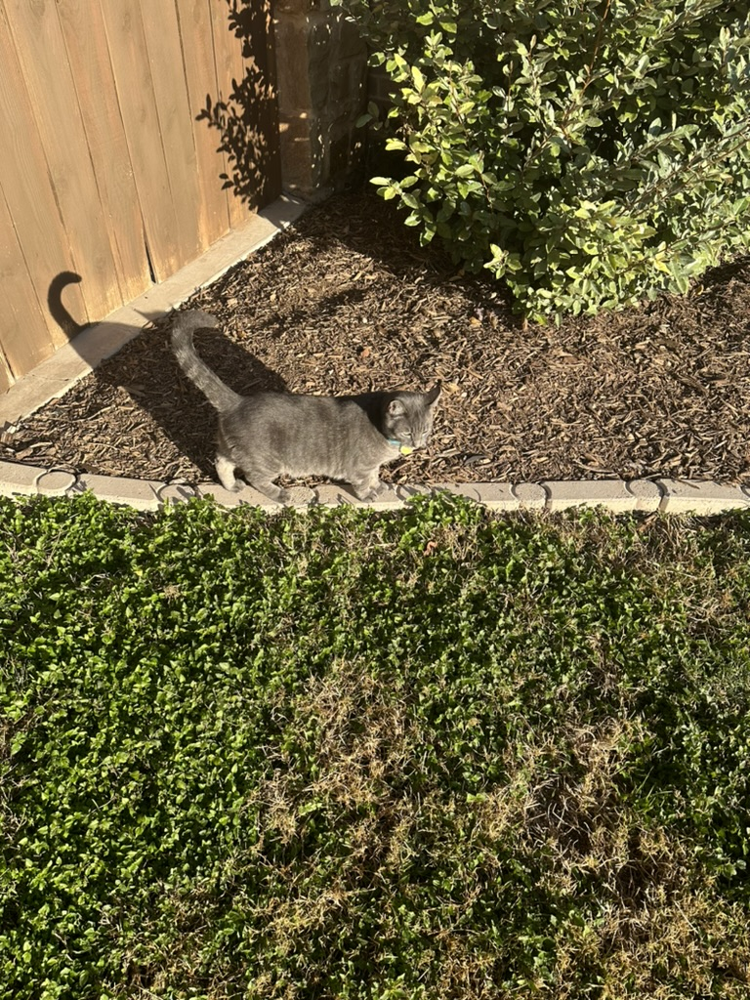

Rouglass, by and large, was content. He had carved out his routines, his favored resting spots, his social circles. There was novelty when he wanted it, quiet when he didn’t, and all the comforts a cat could ask for. He seemed to know his place in the world, and to be at peace with it. This was also a time of memories and experience between him and my family that I will never fully know, though I heard plenty. And everything I heard felt in line with the Rouglass I knew.

But eventually, he grew sick. And while parts of it made sense, in other ways, it never will. When we adopted Rouglass, we were told he had FIV, a feline form of HIV. A bit of research revealed what that meant: a weakened immune system, a greater vulnerability to illness, and often, a shortened lifespan. But those facts sat somewhere in the background, theoretical and distant. So when he began to lose weight and a cyst was found on his kidney, it didn’t register as the beginning of the end. Not really. We knew he had limits, but it hadn’t occurred to us that time might be running out.

# In The End

I'm sure there's many more memories that might only come up against the backdrop of specific queues, or maybe never again. This is just how the stories we tell ourselves work. His life means something to those who knew him, or know of him. Preserving his memory in some form, at the very least, just hints at how important he was to myself, Abi, my Dad, and others.

In the end, when Rouglass went in for surgery to remove the infected kidney, he never made it through recovery. For reasons we will never fully understand, his body gave up under the shock and stress of it. Much will always be unclear, but what can you expect from an animal that is free in spirit. They cannot communicate their pain. He passed quickly, so perhaps his pain was short. Or maybe the months of lurking disease were a slow drain. They just live, fully and without pretense, until they don’t.

Cats are private creatures, and Rouglass was no exception. He gave what he chose to give, held the rest close. He lived on his own terms, with a quiet dignity, and when the time came, he slipped away the same way he moved through life, without ceremony. Cats live in the moment, and I know we gave Rouglass many many moments to enjoy. And he took them. Fully, instinctively, like only a cat can. In return, he gave us more than we could have known to ask for.

*I used to think we were shaping his world — feeding him, caring for him, keeping him safe. But now I know he shaped ours. His influence slowed us down, drew us to the subtle details, and softened our hearts, all without our noticing. Rouglass wasn’t just a pet. He was a presence. A rhythm. And now, a memory that will stay with us, quiet and steady, like the sound of paws crossing the room in the middle of the night.*

# Extras

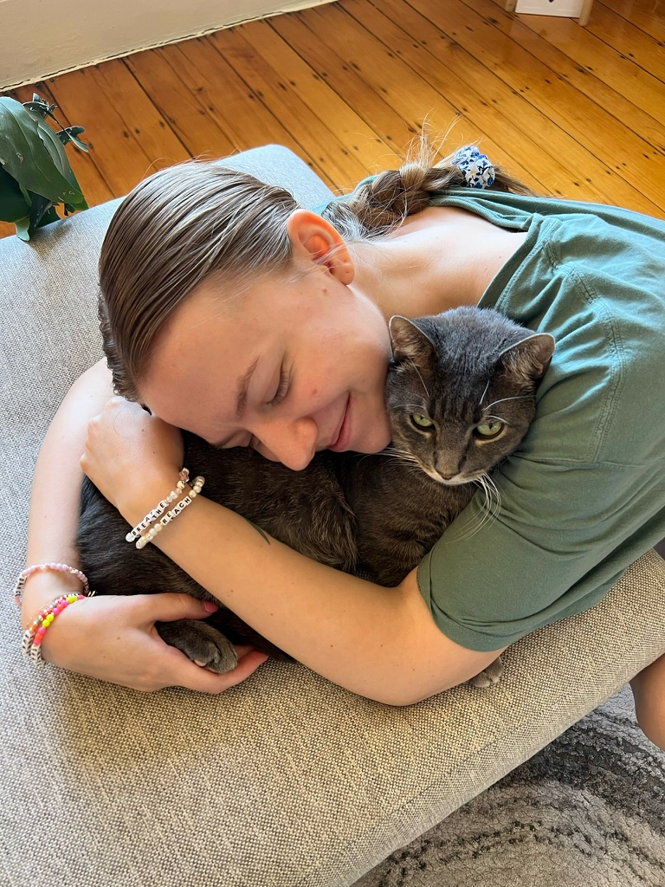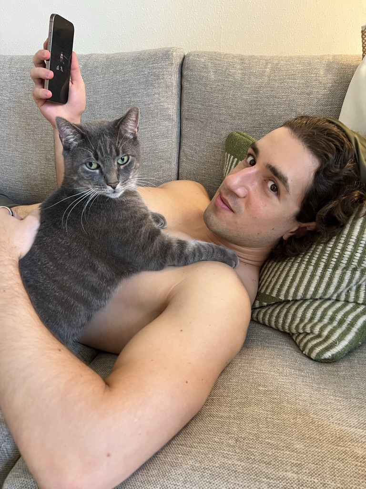
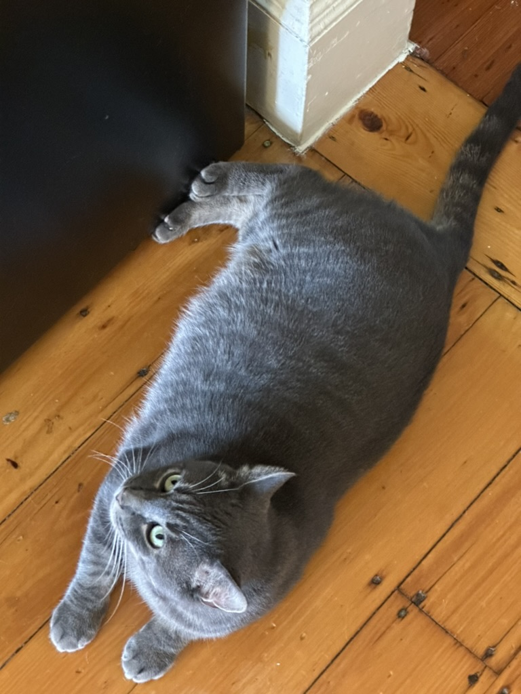

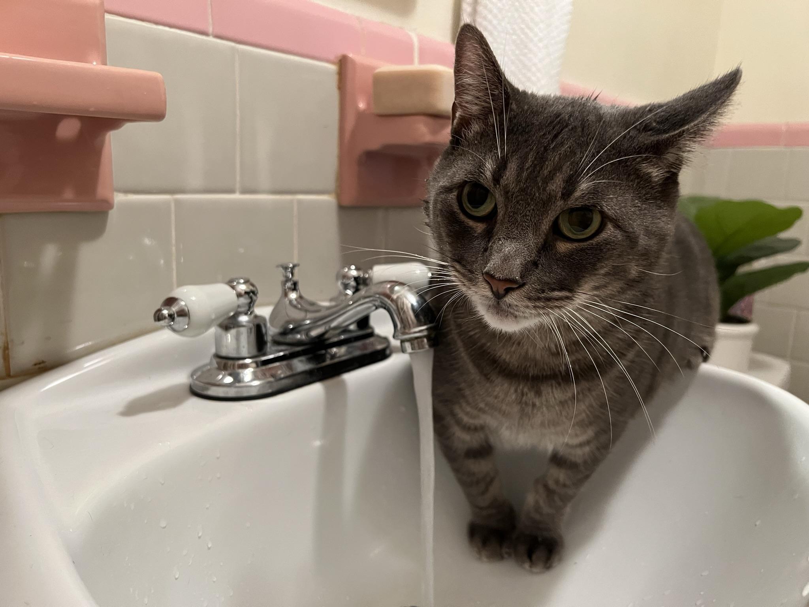

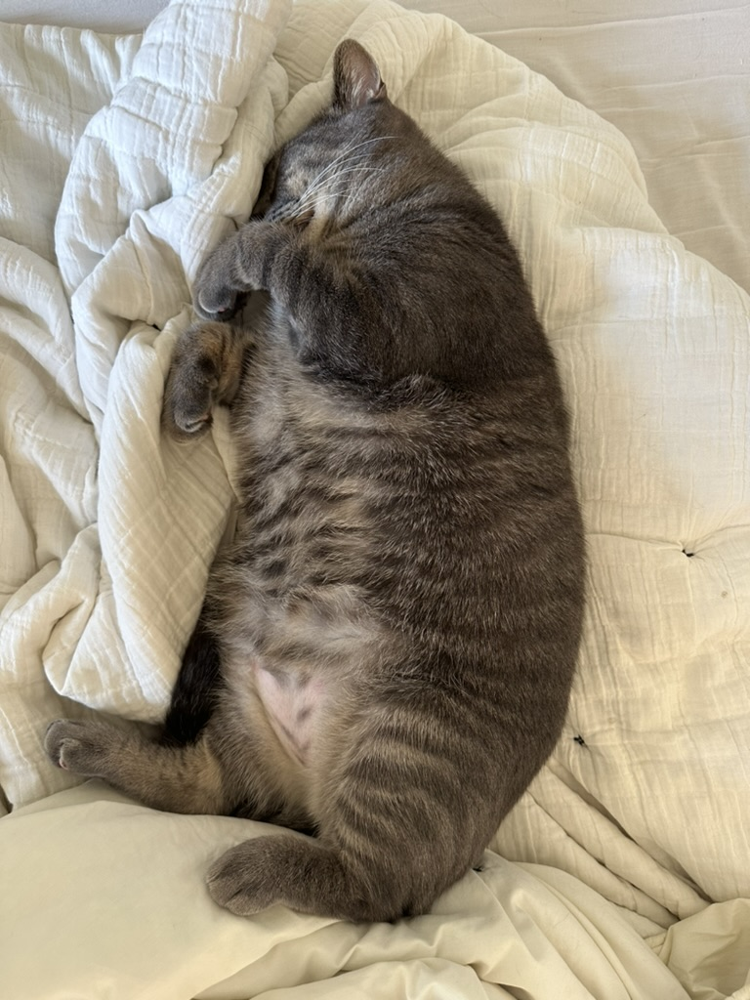
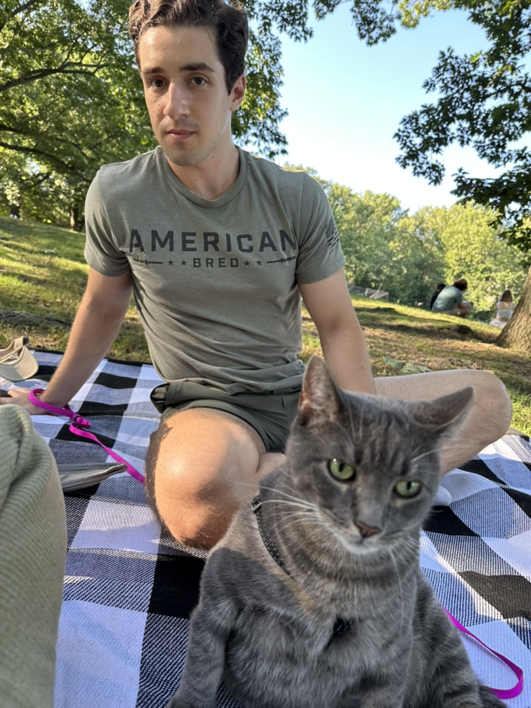

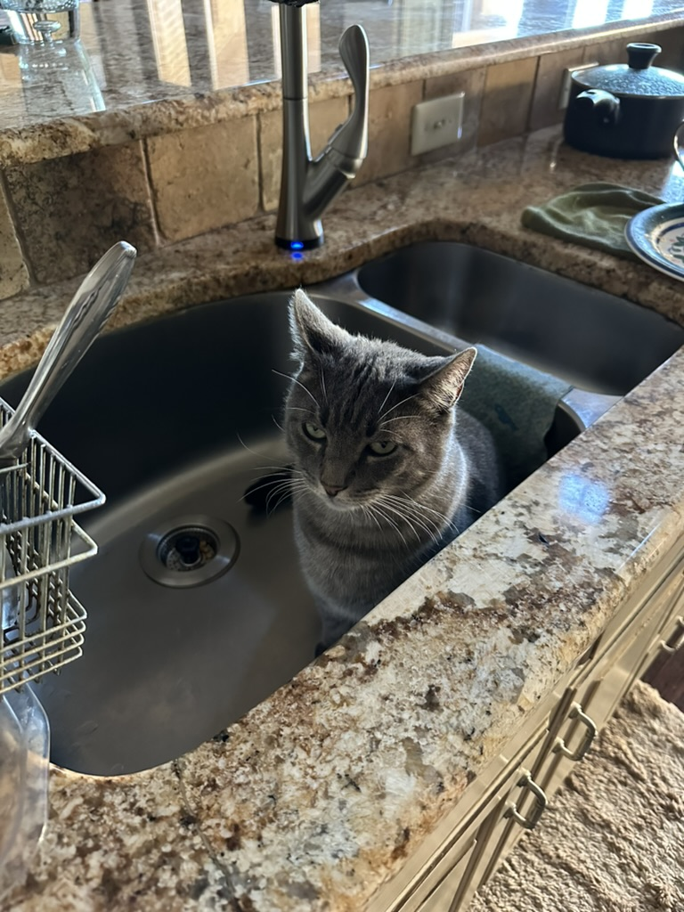

---

*Thank you to my wife Abigail for reviewing this writing. Further gratitude goes to her and my parents for joining me in providing care, time, and attention to Rouglass over the years.*