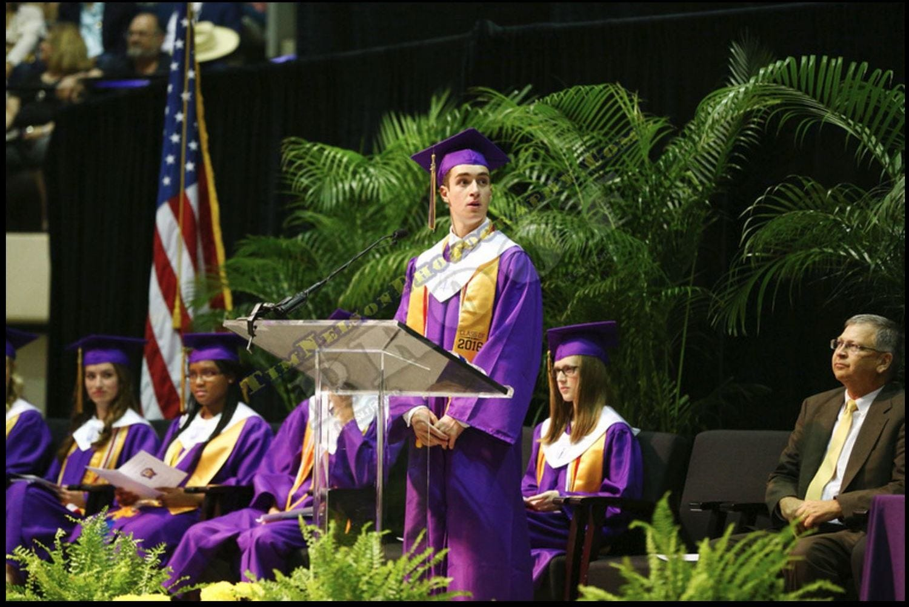

---
tags:
  - speech
date: May 28, 2016
publish: true
image: 
slug: smooth-reverie
origin: https://archive.reporternews.com/opinion/columnists/salutatory-address-brian-fakhoury-wylie-something-i-call-smooth-reverie-33a05733-c6bf-7628-e053-0100-381127131.html/
description: 
title: "Salutatory Address: Smooth Reverie"
---

I call this speech “Smooth Reverie.” I wrote this in a series of sweaty sessions across particularly random hours of the 24-hour day, and fully understand and admit that by no means this writing would receive a passing grade from one of my stricter English teachers. Now, a reverie is a daydream, or fantastic vision, and tonight, we capture a part of our lives in a snapshot that will forever shine brilliantly in our memories. Like a herd of water buffalo, we as a class have stomped through our grade school years, and like a lost lion, we as a class have courageously made it to graduation.

Although our lives before 9th grade are nonexistent to the university’s cold eye sockets, it is still important to reflect on what brought us here today. Our families loved and supported us… Our teachers guided us… And our friends marched with us…. Every one of my classmates’ names that will be read tonight carries a story, a unique and individual story that will hopefully affect the world.

Audience, you are looking at young adults that constitute the larger age group that will change the world, undeniably. Just as any student body becomes great, and any group of people becomes great, we have shared and nurtured our unique talents, for we the people are only powerful because of “we.” Not you, or him or her, or ze or zer; but “Us,” and when we understand who we each are, we can turn to each other, and make our contribution like Kennedy’s request that we people ask what can we do for our country. Let me continue to reflect on who we became with this inspiring quote:

> _I guess you’re right, Plankton. I am just a kid. And you know, I’ve been through a lot in the past six days, five minutes, twenty-seven-and-a-half seconds. And if I’ve learned anything during that time, it’s that you are who you are. And no amount of mermaid magic… or managerial promotion… or some other third thing… can make me anything more than what I really am inside [….] But that’s okay. Because I did what everyone said [I] couldn’t do. I made it […] So, yeah, I’m a kid. And I’m also a goofball. And a wing nut. And a Knucklehead McSpazatron! But most of all…_

In the case of this street poet and philosopher, Mr. Squarepants; most of all, he was a goofy goober. While I assume that partially describes most of us, I asked others who they were inside, above all, who they understood themselves to be. Many stand confident they are different. Nicholas is excited, Clayton knows he is unique, Caden is a child of God, John from Florida is certain that life is a labyrinth, Jesus from the Walmart Janitorial Staff is happy, but I digress from our class… Madison and Aaron are looking forward, Madeline is thankful for the people, and Parker is “ready.” Ready for what, we may never know, I hope it is legal. The phenomenal thing about this is the character of the present, and that is the celebration of the moment tonight, who we are at the present, and who we have become.

Now, as many of you know me, I cannot help but stray from the serious flow of ideas. So, I would like to tell of our past high school years in a form of story.

It is August of 2012 in North America. In a remote grassland, the sunshine flows over a flock of young kids, the freshman, who have for the first time reached new grounds, high school. The morning heat carries the sweet, sensational aromas of coffee, deodorant, and various teenage pheromones. Their parents have left them to fend on their own. They hope their bright yellow shoes and backpacks will be a valid form of disguise. They scurry straight into the cafeteria, avoiding the dangerous parking lot grounds, were the elder reign freely. Some of the more anxious males attempt to court females, but fail to no ado, wondering if it was because they were not wearing enough assorted colognes. But, this is only the calm. All of a sudden the scene turns dark, malicious; the freshmen are about to gaze into the face of true hysteria. The first bell of the day has rung. Like a stampede, the upper-class begins their migration disregarding the small, innocent bodies of the young, and instinctually moving to their dedicated learning rooms, leaving behind remnants of trash and excrement. The freshmen are left behind to trickle to their rooms, sadly, but courageously; bruised, but standing strong. Skip forward one year, now they are more trained, titled sophomores. Some have infiltrated and befriended the higher ranks. Importantly, they know to move to the side to let an upperclassman pass as a sign of respect and fear, that bright blue is way cooler than bright yellow, and mitochondria are the powerhouse of the cell. Slowly, through the years, social structure emerges. The athletes, the nerds, the cool guys, the band geeks, the man buns, etc…. Four years later, these tiny, wide-eyed beings have grown to full size, have mastered the teenage slang, and are more fun than ever seen before. They have now mastered their survival skills, being able to judge anyone in less than a millisecond. Now, it is May, 2016. These seniors have quite developed their own attitude, independent of other grades, and have learned what it takes to fend for one’s self. The wild cycle continues as this emotional group cries over their years of harsh training, claiming it was fun.

While this story is powerful, it is imperative to note that figurative phrases are only a part of describing our success. Just like first is worst and second is best, we let each other guide, and trust in ourselves to uphold our standards. I am so proud of our generation. Look at our vocabulary, we have constructed ways to explain our feelings and situations like never before. For example, words like “yeet, lit, dab, lean, fleek” have truly been synthesized. Besides our culture, we have been a conscious generation, whether it comes to roasting others or discussing awfully annoying issues in our world, we fully understand what is to come. On behalf of our generation, we the graduates, sitting on the floor tonight, assume our societal responsibilities.

Now, before I close, let me clarify to some degree. What we have worked so hard for does not simply amount to a diploma. You cannot actually do much with the physical diploma. You could smoke it but I would not advise it… Instead, it is up to us to continue our work, and action, and take tonight as a check point in our pursuit of better.

Like a lost lion, we as a class have made it to graduation, congratulations, I love you all so much.