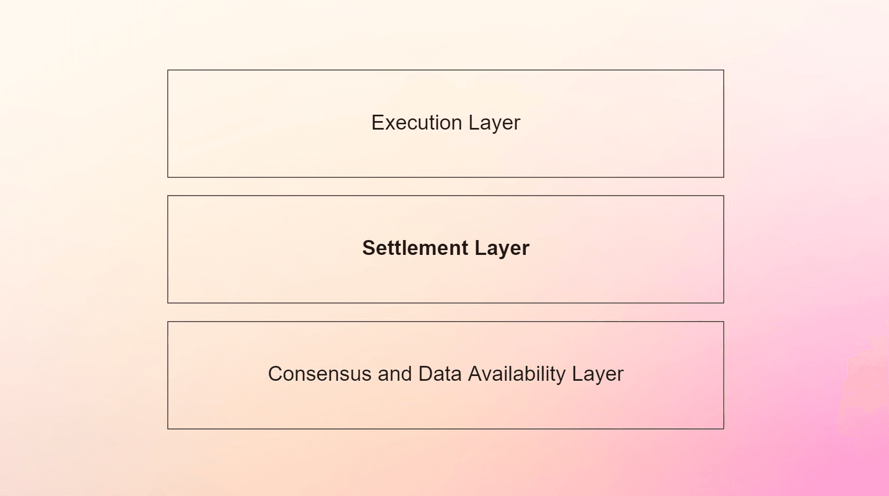

---
tags:
  - crypto
  - tech
date: 2022-10-19
publish: true
image: 
slug: settlement-layers
origin: https://mirror.xyz/fakhoury.eth/SqXRPk0MonKK81KI4UWv7o0QnspPQd3rk8h_GLyD0Po
description: A settlement layer records digital asset ownership. Ethereum leads now, but new blockchains may challenge as crypto grows.
title: Settlement Layers
---
**A settlement layer is where the final ledger of an asset lies.**

For physical goods & commodities, this definition is trivial, it’s just physics. For traditional, intangible financial assets, the ledger lies with some central authority. In the world of digital assets where the assets themselves are emergent from cryptonetworks, it’s not as straightforward.

Bitcoin’s settlement layer is on the bitcoin network. ETH settles on Ethereum mainnet. USDC has multiple settlement layers across many smart contract platforms (Circle mints canonical USDC on a handful of different chains). USDC on Arbtirum settles on Ethereum mainnet. USDC.e on Avalanche C-chain settles on Ethereum mainnet while USDC on Avalanche C-chain settles natively on the Avalanche C-chain.

Settlement layers have gotten significantly more complex as modular blockchains have become the [preferred scaling method](https://ethereum-magicians.org/t/a-rollup-centric-ethereum-roadmap/4698) for Ethereum, and have always been the [long-term](https://v1.cosmos.network/resources/whitepaper) vision for Cosmos. In the context of settlement layers, to be modular means to (optionally) have a native unit of account whose ledger is not stored locally. For example, this could mean using ETH as a gas token for another network, as Arbitrum and Optimism do for their rollups. While you can deploy an ERC20 token on Arbitrum One that natively settles within the Arbitrum execution environment, many tokens on Arbitrum One, including ETH itself, settle back on the Ethereum mainnet. Since these tokens are brought over through an enshrined bridge in the Arbitrum protocol, we can say that Arbtitrum settles on Ethereum. If tokens are brought over (wrapped) by a third-party bridge from another network, Solana for example, we would _not_ say that Arbitrum settles on Solana.

**Being a settlement layer brings long-term network effects.**

Since a settlement layer is where the ledger of an asset lies, it becomes very sticky once a specific settlement layer is settling many assets. The best example here is the Ethereum mainnet. The canonical Ethereum network pioneered the ERC20 smart contract-based token, which caught fire during the ICO boom and has led to billions of dollars of non-ETH value being recorded on the Ethereum network.

ETH being the biggest settlement network for tokens has forced new networks to depend on the bridging of these tokens to help bring assets into their new ecosystem, inadvertently strengthening Ethereum’s grasp as a settlement layer. Tokens like LINK, USDC, stETH, etc… have all been popular assets in crypto to bring over to new networks in order to bootstrap economic activity on the new chain.

With over $100B+ of assets at its peak, Ethereum became an indispensable settlement layer in the crypto economy. It still dominates today because of the network effects of being a settlement layer, namely: long-term **integrity**, deep stablecoin **liquidity**, and credible **neutrality** (anyone can bridge assets from Ethereum without risk of censorship).

It’s not necessarily always going to be this way. Creating a ledger and settling on Ethereum is relatively slow, very expensive, and prone to bugs. A number of projects are vying to become “optimized” settlement layers to take the ease off of building a hardened bridge to Ethereum, which has proven to be a very difficult endeavor (see [here](https://www.cnbc.com/2022/08/10/hackers-have-stolen-1point4-billion-this-year-using-crypto-bridges.html) and [here](https://cointelegraph.com/news/barely-halfway-and-october-s-the-biggest-month-in-crypto-hacks-chainalysis)).

_Settlement layers are a killer app for crypto nonetheless_, and the value of settlement comes from the value of the assets that are being settled. As crypto grows in importance and market cap, what look to be small settlement layers today can quickly become a global super highway of value. Serving the accounting for this value will prove to be massively valuable. _That’s why you should pay attention to settlement layers._