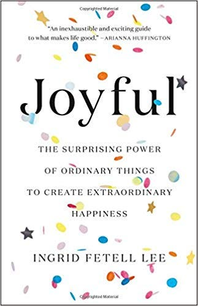
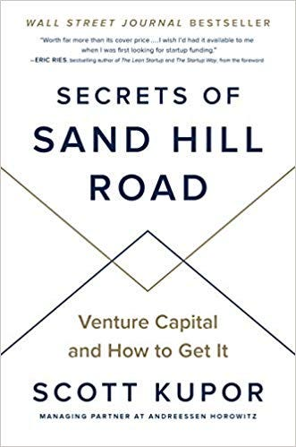

---
tags:
  - books
  - reading
date: Aug 29, 2019
publish: true
image: 
slug: aug-2019-book-snippets
origin: https://brianfakhoury.medium.com/7-books-for-august-quick-snippets-on-what-ive-read-65a1a5a0885
description: 
title: 7 Books for August — Quick Snippets on What I’ve Read
---

## **1. Thinking Fast and Slow**

Mixing economics and human behavior, Daniel Kahneman — a wonderful economist — masterfully translated the consequences of quick human evolution into how our everyday lives are impacted by our circuitry. A great example I learned about was that persuasion relies on a relaxed mind listening to a repeated message. According to Kahneman, this happens in the “fast” system in the brain, while the slow system is more energy-consuming and less relaxing as a consequence. The takeaway for me is that the balance of these two systems is what we’re fighting to figure out in the modern world, where once it was easy to use the slow system when necessary and trust the fast system otherwise, we know overuse the slow system and engage the fast system in the wrong moments.

## **2. Joyful**

This one stands out of the list as markedly different, as it is written on design and the philosophy thereof. Having sympathized with minimalism since high school, this book challenged my previous mode of thought and was successful at that as a matter of fact. My main takeaway is that objects and settings that are natural and colorful can spark a ceaseless joy that will improve one’s life. This is different than a burst of happiness, it’s more of an increased ambiance that does not wither. Practically, this fits my philosophy of carefully designing my living environment to be aesthetic, and I’ve picked up a few tips on adding color and random items that fit the atmosphere to achieve a greater feeling of joy.

## **3. Homo Deus**

Long overdue, the middle child to Sapiens and 21 Lessons was yet another fascinating read by a prolific author, Yuval Harari. He really highlights the changing nature of how we view the world, and how it is accelerating. A takeaway point from the book is that the dominant story of liberalism is built on human experience, and threatened by science, and more specifically, algorithms. Free will, while a comforting myth, is being more and more challenged by technological evolution.

## **4. Secrets of Sand Hill Road**

I picked up this book to learn more about venture capital but found the VC standpoint lacking. Still, the startup advice was top notch. The two biggest points I got from the book was the importance of founder-market fit and product breakthrough. Founder-market fit is all about why the founder of a startup is the right person to solve a market’s problem. Many people can arrive at a great idea and begin to execute on it, but a differentiating factor can come down to a founder having the right qualities and experience to grow in that market exponentially faster. On the other hand, the given product cannot be a little bit better than what current market solutions — it has to be much better, a breakthrough, in order for adoption to happen and high-growth to take place.

## **5. Super Thinking**

I had this book on an open amazon tab for the entire summer because I was really excited to read something on this topic. After the dust settled, I was not too impressed, but I still had some great takeaways. The key point this book is trying to convey is that you can apply a few common frameworks to a host of thought processes and questions that you might experience throughout the day. For example, when you’re unsure of what to do, the scientific method is a fantastic framework for testing your own hypothesis, and not relying on Google and someone else’s thoughts. Now take this framework, and use it as a foundation for other frameworks. Critical mass, Occam’s razor, etc… can then be applied on top of the scientific method. One more great tip I learned was to use a variant of a pro-con list called a numbered pro-con list where you assign weights to the pros/cons.

## **6. Influence**

For being an older book, I was pleasantly surprised by how relevant the information was while reading it. I mainly took home some everyday tactics. For example, I learned that favors should always come attached with a reason as it makes people much more likely to respond. I learned that hard work makes people value the thing they worked for (of course) and that social proof (queue the laugh track) is always sought after by people — that's why we often hear phrases like “fastest-growing” and “best selling”. Also, limiting something by time influences people to act rather than not. These were all pretty general and not hard to come by, but it’s always impactful reading them in text and mulling over it some more in your mind.

## **7. Common Sense**

Last on my list predates everything else on the list by a long shot. I read common sense hoping to see backward in time a few centuries. The two big points I got, from the setup of America, is that given people are equal and identify however they want, people in America at the time decided to identify as American, not British. This led to them breaking off, and the USA was born. Next, from this point, monarchy does not let identity play a part in government nor treat people as equal, and, therefore, representative governments are the better alternative for individual expression and equality.

I hope you enjoyed my thoughts!

Until the next book snippets,

Brian.