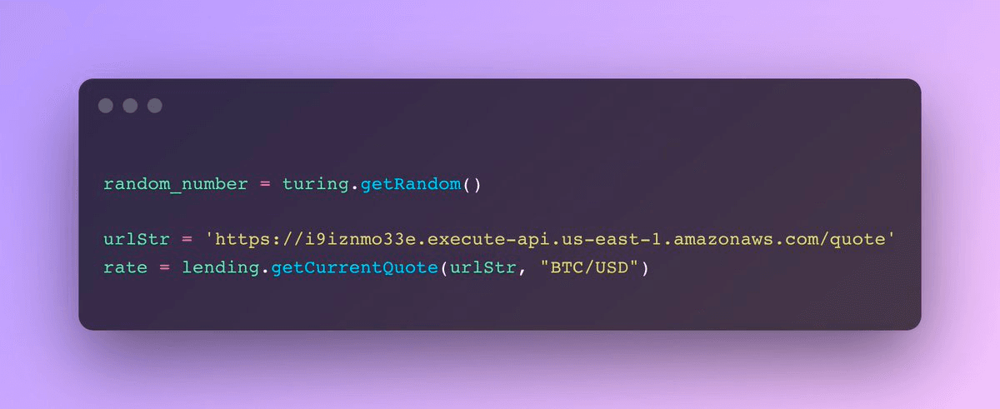

---
tags:
  - crypto
  - programming
  - tech
date: Jan 24, 2022
publish: true
image: 
slug: hybrid-compute
origin: https://mirror.xyz/fakhoury.eth/v0pryMFMTyRiuYMKtwUEPEPSomdcE6XN1XEhuEba1xw
description: 
title: Hybrid Compute Smart Contract Platforms
---
I originally posted this analysis on Twitter here: https://x.com/brianfakhoury/status/1485150532897591301

---

I came across something interesting that the team behind Boba network is working on: https://github.com/omgnetwork/optimism-v2

TLDR: blockchains are *supposed* to be perfectly discrete state machines with no outside effects. But, if you're a rollup, perhaps fraud proofs can add some slack.

The idea here is "hybrid compute" smart contracts -- everything functions normally, but contract code can also query an external API.

On an L1 chain, this would be ludicrous as APIs are the antithesis to a predictable/unchanging state. The number of attack vectors would be huge.

You need to be able to replay the chain and not have to worry about an API endpoint being down or returning different data.

Throwing this assumption aside for a moment, this power would be incredibly useful for things like random number generation, price oracles, compute, etc..

Of course, it falls heavily on developers to use secure endpoints and correctly represent the risk on the front end.

I'm not saying it's a good idea, I just think it's sick tech. Here's a quick overview of how it works in their "Turing" implementation:

Imagine being able to write code like this inside a contract.

(technically only 1 turning call can happen per transaction, assuming this is bc of a recursion attack)

To enable this type of EVM execution, the Geth client (L2TGeth) is first modified at the execution layer.

L2TGeth, in simple terms, intercepts function calls that have an external effect, replaces the inputs, and continues executing EVM like nothing happened.

The hard part comes at the consensus -- it's difficult for other verifiers to re-execute transactions with an RNG, for example.

To overcome this part, Turing transactions are saved into block metadata which is understood to be parsed "as is" by other L2TGeth clients.

The representation of Turing transactions occurs in the canonical transaction chain (CTC), meaning there are no special exceptions happening at the consensus layer, and consequentially in the L1 contracts...

Assuming all the complicated plumbing works, how is fraud prevented?

As a quick refresher, blocks on rollups are put together by "sequencers," a special node on the network that is responsible for ordering transactions. Sequencers do not have to be fully decentralized, and it's up to the rollup governance to decide who has the ability to run one

So while anyone can verify the validity of an optimistic rollup like Boba, only a privileged sequencer can actually produce a block.

In the case of a system like Turing, this is especially important because sequencers can have a reputation.

Right now, there's only 1 sequencer on the Boba network, while there are many nodes that relay transactions and verify the state. So, if you see where I'm going here, the sequencer, being metaphorically watched by the whole world, can't risk losing trust.

On one hand, user funds are always available by mainnet security, and on the other hand, funds that are ephemerally at risk by a Turing call, likely a fraction of the economic value of the rollup, are kept in check by social consensus.

Should the sequencer try to game a Turing transaction, it's likely social consensus will halt the flow of future Turing transactions immediately and punish the sequencer later perhaps by removing it entirely!

These types of economic systems are exciting *because* they are imperfect, yet they have the potential to further open up the design space on public blockchains.

You don't have to look much farther than current bridges/xchain messaging to see these same dynamics...

So while the fraud proving system doesn't directly disincentivize bad behavior, the nature of permissioned sequencers and public state make this something possible in practice.

Unfortunately, I couldn't get the tests to work on my machine, which is a hint at the lift that this probably takes for it to be considered robust.

Regardless, hope someone learned something from this, and I hope to see others experimenting as well

